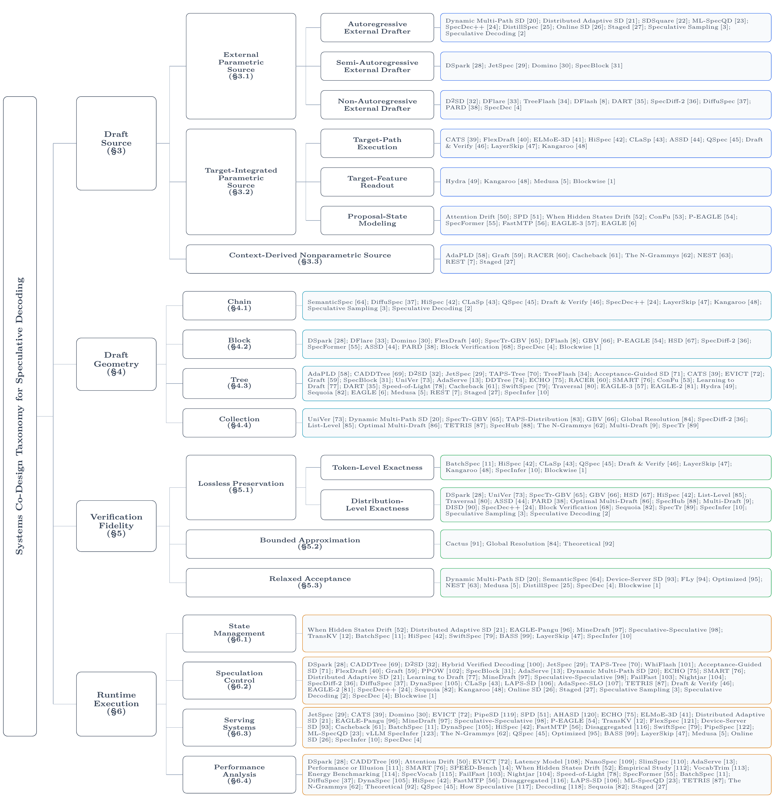

# 📚 Awesome Speculative Decoding

> Companion Method Profiles for a systems co-design survey of speculative decoding.

[](https://github.com/sindresorhus/awesome)

[](https://www.preprints.org/manuscript/PREPRINT-LINK-PENDING)
[](https://lifeissosolong.github.io/awesome-speculative-decoding/)

Our survey organizes speculative decoding from a **systems co-design perspective** across four connected aspects: **Draft Source**, **Draft Geometry**, **Verification Fidelity**, and **Runtime Execution**. This companion repository provides Method Profiles for all 304 included works, including category assignments, paper and code links, a complete chronological table, and an interactive explorer for filtering, comparing, sharing, and exporting results.

> **Help us keep this resource accurate and up to date.** If you spot an incorrect taxonomy assignment or know of a relevant new work that should be included, please [open an issue](https://github.com/LifeIsSoSolong/awesome-speculative-decoding/issues/new). When possible, include the paper link and a brief explanation of the suggested correction or addition.

## 📰 News

- **2026&#8209;07&#8209;23** The [Interactive Method Profiles Explorer](https://lifeissosolong.github.io/awesome-speculative-decoding/) is now open.
- **2026&#8209;07&#8209;20** Initial release: 304 Method Profiles were organized across four systems-view aspects.

## 📝 Citation

If you find this survey or repository useful, please consider citing our survey:

[*From Draft-Then-Verify to Systems Co-Design: A Survey of Speculative Decoding for Autoregressive Large Language Models*](https://www.preprints.org/manuscript/PREPRINT-LINK-PENDING)

```bibtex
@misc{zhao2026draftthenverify,
  title = {From {Draft-Then-Verify} to {Systems Co-Design}: A Survey of Speculative Decoding for Autoregressive Large Language Models},
  author = {Zhao, Kaikai and Liu, Zhaoxiang and Jiang, Che and Chen, Ping and Wang, Xin and Tian, Kai and Wang, Ning and Wang, Yuru and Shen, Yi and Yan, Jiangze and Hua, Minjie and Zhang, Wenjing and Wang, Xiang and Wang, Kai and Zhang, Kaiyan and Sun, Youbang and Ding, Ning and Lian, Shiguo and Zhou, Bowen},
  year = {2026},
  url = {https://www.preprints.org/manuscript/PREPRINT-LINK-PENDING}
}
```

## 🔎 Interactive Method Profiles Explorer

[**Open Explorer →**](https://lifeissosolong.github.io/awesome-speculative-decoding/)

Filter profiles by year, taxonomy category, contribution role, or resource availability. Compare methods, inspect the current landscape, share a filtered view, or export it as CSV. Try the one-click [2026 + Tree view](https://lifeissosolong.github.io/awesome-speculative-decoding/?year=2026&geometry=tree).

## 🧭 Taxonomy

<p align="center">
  
</p>

## 📚 Method Profiles

<!-- BEGIN MATRIX INTRO -->
Each profile maps one included work to its assignments across the four aspects. `[core]` marks a category introduced, substantively changed, or directly studied; `[inherited]` marks a category explicitly adopted as a substrate rather than changed by the work. The symbol `--` indicates that the reported research unit has no explicit category assignment in that aspect.
<!-- END MATRIX INTRO -->

<!-- BEGIN GENERATED WORK MATRIX -->
| Work | Draft<br>Source | Draft<br>Geometry | Verification<br>Fidelity | Runtime<br>Execution | Links&nbsp;&nbsp;&nbsp;&nbsp;&nbsp;&nbsp;&nbsp;&nbsp;&nbsp;&nbsp;&nbsp;&nbsp;&nbsp;&nbsp;&nbsp;&nbsp;&nbsp; |
| --- | --- | --- | --- | --- | --- |
| <strong>DSpark</strong> · 2026&#8209;07<br>DSpark: Confidence-Scheduled Speculative Decoding with Semi-Autoregressive Generation | Semi-Autoregressive<br>External Drafter [core] | Block [core] | Distribution-Level<br>Exactness [core] | Speculation Control [core]<br>Performance Analysis [core] | <a href="https://arxiv.org/abs/2607.05147"></a><br><a href="https://github.com/deepseek-ai/DeepSpec"></a> |
| <strong>AdaPLD</strong> · 2026&#8209;06<br>AdaPLD: Adaptive Retrieval and Reuse for Efficient Model-Free Speculative Decoding | Context-Derived<br>Nonparametric Source [core] | Tree [core] | Distribution-Level<br>Exactness [inherited] | Speculation Control [inherited]<br>Serving Systems [inherited] | <a href="https://arxiv.org/abs/2606.05742"></a> |
| <strong>BudgetDraft</strong> · 2026&#8209;06<br>BudgetDraft: Acceptance-Aware Multi-View Training for Sparse-KV Speculative Decoding | Autoregressive<br>External Drafter [core] | Chain [core] | Token-Level<br>Exactness [core] | State Management [core]<br>Speculation Control [core] | <a href="https://arxiv.org/abs/2606.00144"></a> |
| <strong>CADDTree</strong> · 2026&#8209;06<br>Cost-Aware Diffusion Draft Trees for Speculative Decoding | Non-Autoregressive<br>External Drafter [inherited] | Tree [core] | Token-Level<br>Exactness [inherited]<br>Distribution-Level<br>Exactness [inherited] | Speculation Control [core]<br>Performance Analysis [core] | <a href="https://arxiv.org/abs/2606.01813"></a> |
| <strong>D2SD</strong> · 2026&#8209;06<br>D^2SD: Accelerating Speculative Decoding with Dual Diffusion Draft Models | Non-Autoregressive<br>External Drafter [core] | Tree [core] | Token-Level<br>Exactness [inherited]<br>Distribution-Level<br>Exactness [inherited] | Speculation Control [core]<br>Serving Systems [inherited] | <a href="https://arxiv.org/abs/2606.04446"></a> |
| <strong>DFlare</strong> · 2026&#8209;06<br>DFlare: Scaling Up Draft Capacity for Block Diffusion Speculative Decoding | Non-Autoregressive<br>External Drafter [core] | Block [core] | Token-Level<br>Exactness [inherited] | Speculation Control [inherited]<br>Serving Systems [inherited] | <a href="https://arxiv.org/abs/2606.02091"></a><br><a href="https://github.com/Tencent/AngelSlim"></a> |
| <strong>Dynamic Exits</strong> · 2026&#8209;06<br>Experience-Driven Dynamic Exits for LLMs with Reinforcement Learning | Target-Path<br>Execution [core] | Chain [core] | Distribution-Level<br>Exactness [core] | Speculation Control [core] | <a href="https://arxiv.org/abs/2606.03113"></a> |
| <strong>EfficientRollout</strong> · 2026&#8209;06<br>EfficientRollout: System-Aware Self-Speculative Decoding for RL Rollouts | Target-Path<br>Execution [core] | Chain [inherited] | Distribution-Level<br>Exactness [core] | Speculation Control [core]<br>Serving Systems [core]<br>Performance Analysis [core] | <a href="https://arxiv.org/abs/2606.18967"></a><br><a href="https://github.com/furiosa-ai/EfficientRollout"></a> |
| <strong>Hybrid Verified Decoding</strong> · 2026&#8209;06<br>Hybrid Verified Decoding: Learning to Allocate Verification in Speculative Decoding | Proposal-State<br>Modeling [inherited]<br>Context-Derived<br>Nonparametric Source [inherited] | Chain [inherited] | Token-Level<br>Exactness [inherited] | Speculation Control [core] | <a href="https://arxiv.org/abs/2606.01019"></a> |
| <strong>JetSpec</strong> · 2026&#8209;06<br>JetSpec: Breaking the Scaling Ceiling of Speculative Decoding with Parallel Tree Drafting | Semi-Autoregressive<br>External Drafter [core] | Tree [core] | Token-Level<br>Exactness [inherited]<br>Distribution-Level<br>Exactness [inherited] | Speculation Control [core]<br>Serving Systems [core] | <a href="https://arxiv.org/abs/2606.18394"></a><br><a href="https://github.com/hao-ai-lab/JetSpec"></a> |
| <strong>SENSE</strong> · 2026&#8209;06<br>SENSE: Semantic Embedding Navigation with Soft-gated Evaluation for Retrieval-based Speculative Decoding | Context-Derived<br>Nonparametric Source [core] | Collection [core] | Relaxed<br>Acceptance [core] | -- | <a href="https://arxiv.org/abs/2606.00021"></a> |
| <strong>TAPS-Tree</strong> · 2026&#8209;06<br>TAPS: Target-Aware Prefix Tree Selection for Diffusion-Drafted Speculative Decoding | Non-Autoregressive<br>External Drafter [inherited] | Tree [core] | Token-Level<br>Exactness [inherited] | Speculation Control [core] | <a href="https://arxiv.org/abs/2606.00487"></a><br><a href="https://anonymous.4open.science/r/TAPS-EMNLP2026-53DD"></a> |
| <strong>TreeFlash</strong> · 2026&#8209;06<br>TreeFlash: Parallel AR-Approximation for Faster Speculative Decoding | Non-Autoregressive<br>External Drafter [core] | Tree [core] | Token-Level<br>Exactness [inherited] | Speculation Control [inherited]<br>Serving Systems [inherited] | <a href="https://arxiv.org/abs/2606.03819"></a><br><a href="https://github.com/ETH-DISCO/TreeFlash"></a> |
| <strong>VIA-SD</strong> · 2026&#8209;06<br>VIA-SD: Verification via Intra-Model Routing for Speculative Decoding | Autoregressive<br>External Drafter [core] | Chain [core] | Relaxed<br>Acceptance [core] | Speculation Control [core] | <a href="https://arxiv.org/abs/2606.12243"></a><br><a href="https://zju-xyc.github.io/VIA-SD-Project-Page/"></a> |
| <strong>WhiFlash</strong> · 2026&#8209;06<br>WhiFlash: Accelerating Speculative Decoding with Token-Level Cross-Paradigm Routing | Non-Autoregressive<br>External Drafter [inherited]<br>Proposal-State<br>Modeling [inherited] | Block [inherited]<br>Tree [inherited] | Token-Level<br>Exactness [inherited] | Speculation Control [core] | <a href="https://arxiv.org/abs/2606.07710"></a> |
| <strong>Acceptance-Guided SD</strong> · 2026&#8209;05<br>Acceptance-Guided Adaptive Speculative Decoding for Efficient Large Language Model Inference | Proposal-State<br>Modeling [inherited] | Tree [core] | Token-Level<br>Exactness [inherited]<br>Distribution-Level<br>Exactness [inherited] | Speculation Control [core] | <a href="https://doi.org/10.1109/ICASSP55912.2026.11463423"></a><br><a href="https://github.com/sunnywyang/ACCEPTANCE-GUIDED-ADAPTIVE-SPECULATIVE-DECODING"></a> |
| <strong>Attention Drift</strong> · 2026&#8209;05<br>Attention Drift: What Autoregressive Speculative Decoding Models Learn | Proposal-State<br>Modeling [core] | Chain [inherited] | Distribution-Level<br>Exactness [inherited] | Performance Analysis [core] | <a href="https://arxiv.org/abs/2605.09992"></a><br><a href="https://github.com/Dogacel/Attention-Drift"></a> |
| <strong>Bastion</strong> · 2026&#8209;05<br>Bastion: Budget-Aware Speculative Decoding with Tree-structured Block Diffusion Drafting | Non-Autoregressive<br>External Drafter [inherited] | Tree [core] | Token-Level<br>Exactness [inherited]<br>Distribution-Level<br>Exactness [inherited] | Speculation Control [core]<br>Performance Analysis [core] | <a href="https://arxiv.org/abs/2605.29727"></a><br><a href="https://github.com/kaist-ai-osi-lab/BASTION"></a> |
| <strong>Cassandra</strong> · 2026&#8209;05<br>Cassandra: Enabling Reasoning LLMs at Edge via Self-Speculative Decoding | Target-Path<br>Execution [core] | Chain [core] | Token-Level<br>Exactness [core] | State Management [core]<br>Serving Systems [core] | <a href="https://arxiv.org/abs/2605.26558"></a> |
| <strong>CATS</strong> · 2026&#8209;05<br>CATS: Cascaded Adaptive Tree Speculation for Memory-Limited LLM Inference Acceleration | Target-Path<br>Execution [core] | Tree [core] | Token-Level<br>Exactness [inherited]<br>Relaxed<br>Acceptance [inherited] | Serving Systems [core] | <a href="https://arxiv.org/abs/2605.11186"></a><br><a href="https://github.com/ElizaFuLan/CATS.git"></a> |
| <strong>Component-Aware SD</strong> · 2026&#8209;05<br>Component-Aware Self-Speculative Decoding in Hybrid Language Models | Target-Path<br>Execution [core] | Chain [core] | Distribution-Level<br>Exactness [core]<br>Token-Level<br>Exactness [core] | Serving Systems [core]<br>Performance Analysis [core] | <a href="https://arxiv.org/abs/2605.01106"></a><br><a href="https://github.com/hecboar/hybrid-speculative-decoding"></a> |
| <strong>CoSpec</strong> · 2026&#8209;05<br>Beyond the Target: From Imitation to Collaboration in Speculative Decoding | Autoregressive<br>External Drafter [inherited] | Chain [inherited] | Relaxed<br>Acceptance [core] | -- | <a href="https://arxiv.org/abs/2605.24793"></a> |
| <strong>Cross-Language SD</strong> · 2026&#8209;05<br>Speculative Decoding Across Languages | Autoregressive<br>External Drafter [core]<br>Context-Derived<br>Nonparametric Source [core] | Chain [core] | Distribution-Level<br>Exactness [core] | Performance Analysis [core] | <a href="https://arxiv.org/abs/2605.30580v1"></a> |
| <strong>Domino</strong> · 2026&#8209;05<br>Domino: Decoupling Causal Modeling from Autoregressive Drafting in Speculative Decoding | Semi-Autoregressive<br>External Drafter [core] | Block [core] | Token-Level<br>Exactness [inherited] | Serving Systems [core] | <a href="https://arxiv.org/abs/2605.29707"></a><br><a href="https://github.com/jianuo-huang/Domino"></a> |
| <strong>EVICT</strong> · 2026&#8209;05<br>Making Every Verified Token Count: Adaptive Verification for MoE Speculative Decoding | Proposal-State<br>Modeling [inherited] | Tree [core] | Token-Level<br>Exactness [inherited]<br>Distribution-Level<br>Exactness [inherited] | Serving Systems [core]<br>Performance Analysis [core] | <a href="https://arxiv.org/abs/2605.00342"></a> |
| <strong>EvoSpec</strong> · 2026&#8209;05<br>EvoSpec: Evolving Speculative Decoding via Real-Time Vocabulary and Parameter Adaptation | Proposal-State<br>Modeling [inherited]<br>Context-Derived<br>Nonparametric Source [core] | Tree [core]<br>Chain [core] | Distribution-Level<br>Exactness [core] | Speculation Control [core]<br>Serving Systems [core] | <a href="https://arxiv.org/abs/2605.27390"></a> |
| <strong>FlexDraft</strong> · 2026&#8209;05<br>FlexDraft: Flexible Speculative Decoding via Attention Tuning and Bonus-Guided Calibration | Target-Path<br>Execution [core] | Block [core] | Distribution-Level<br>Exactness [inherited] | Speculation Control [core] | <a href="https://arxiv.org/abs/2605.20022v1"></a> |
| <strong>Future Validity</strong> · 2026&#8209;05<br>Future Validity is the Missing Statistic: From Impossibility to $Φ$-Estimation for Grammar-Faithful Speculative Decoding | -- | Chain [core] | Distribution-Level<br>Exactness [core] | Performance Analysis [core] | <a href="https://arxiv.org/abs/2605.07698"></a> |
| <strong>Graft</strong> · 2026&#8209;05<br>Draft Less, Retrieve More: Hybrid Tree Construction for Speculative Decoding | Non-Autoregressive<br>External Drafter [inherited]<br>Proposal-State<br>Modeling [inherited]<br>Context-Derived<br>Nonparametric Source [core] | Tree [core] | Distribution-Level<br>Exactness [inherited] | Speculation Control [core] | <a href="https://arxiv.org/abs/2605.20104"></a> |
| <strong>Latency Model</strong> · 2026&#8209;05<br>An Interpretable Latency Model for Speculative Decoding in LLM Serving | Proposal-State<br>Modeling [inherited] | Chain [inherited] | -- | Performance Analysis [core] | <a href="https://arxiv.org/abs/2605.15051"></a> |
| <strong>Mistletoe</strong> · 2026&#8209;05<br>Mistletoe: Stealthy Acceleration-Collapse Attacks on Speculative Decoding | Target-Feature<br>Readout [inherited]<br>Proposal-State<br>Modeling [inherited] | Tree [core]<br>Collection [core] | Relaxed<br>Acceptance [core] | Performance Analysis [core] | <a href="https://arxiv.org/abs/2605.14005"></a> |
| <strong>NanoSpec</strong> · 2026&#8209;05<br>NanoSpec: Accelerating Speculative Decoding using Minimalist In-Context Vocabularies | Proposal-State<br>Modeling [inherited] | Tree [inherited] | Distribution-Level<br>Exactness [inherited] | Performance Analysis [core] | <a href="https://arxiv.org/abs/2605.26444"></a> |
| <strong>PARD-2</strong> · 2026&#8209;05<br>PARD-2: Target-Aligned Parallel Draft Model for Dual-Mode Speculative Decoding | Non-Autoregressive<br>External Drafter [core] | Block [core] | Token-Level<br>Exactness [core] | -- | <a href="https://arxiv.org/abs/2605.08632"></a><br><a href="https://github.com/AMD-AGI/PARD"></a> |
| <strong>PARSE</strong> · 2026&#8209;05<br>Parallel Prefix Verification for Speculative Generation | Autoregressive<br>External Drafter [inherited]<br>Proposal-State<br>Modeling [inherited] | Chain [core]<br>Collection [core] | Relaxed<br>Acceptance [core] | State Management [core]<br>Serving Systems [core] | <a href="https://arxiv.org/abs/2605.04263"></a> |
| <strong>PELM</strong> · 2026&#8209;05<br>PELM: Power Efficient On-Device LLM Inference with Speculative Decoding and Dynamic Voltage Frequency Scaling | Target-Path<br>Execution [core] | Chain [core] | Relaxed<br>Acceptance [core] | Speculation Control [core]<br>Serving Systems [core]<br>Performance Analysis [core] | <a href="https://doi.org/10.1145/3774906.3802783"></a> |
| <strong>PipeSD</strong> · 2026&#8209;05<br>PipeSD: An Efficient Cloud-Edge Collaborative Pipeline Inference Framework with Speculative Decoding | Autoregressive<br>External Drafter [inherited] | Chain [inherited] | Distribution-Level<br>Exactness [inherited] | Serving Systems [core] | <a href="https://arxiv.org/abs/2605.13319"></a><br><a href="https://github.com/Ghanyunhe/PipeSD"></a> |
| <strong>PPOW</strong> · 2026&#8209;05<br>Performance-Driven Policy Optimization for Speculative Decoding with Adaptive Windowing | Proposal-State<br>Modeling [inherited] | Tree [inherited] | Distribution-Level<br>Exactness [inherited] | Speculation Control [core] | <a href="https://arxiv.org/abs/2605.14978"></a> |
| <strong>RAC</strong> · 2026&#8209;05<br>RAC: Request-adaptive Configuration for Efficient Speculative Decoding | Autoregressive<br>External Drafter [core] | Chain [core] | Token-Level<br>Exactness [core] | Speculation Control [core]<br>Performance Analysis [core] | <a href="https://doi.org/10.65109/sgxl4097"></a><br><a href="https://github.com/JhSheng/RAC-"></a> |
| <strong>RTP-LLM</strong> · 2026&#8209;05<br>RTP-LLM: High-Performance Alibaba LLM Inference Engine | Autoregressive<br>External Drafter [inherited]<br>Target-Feature<br>Readout [inherited]<br>Proposal-State<br>Modeling [inherited]<br>Context-Derived<br>Nonparametric Source [inherited] | Chain [inherited]<br>Tree [inherited] | Distribution-Level<br>Exactness [inherited] | State Management [core]<br>Serving Systems [core] | <a href="https://arxiv.org/abs/2605.29639"></a><br><a href="https://github.com/alibaba/rtp-llm"></a> |
| <strong>SlimSpec</strong> · 2026&#8209;05<br>SlimSpec: Low-Rank Draft LM-Head for Accelerated Speculative Decoding | Proposal-State<br>Modeling [inherited] | Tree [inherited] | Token-Level<br>Exactness [inherited]<br>Distribution-Level<br>Exactness [inherited] | Performance Analysis [core] | <a href="https://arxiv.org/abs/2605.10453"></a> |
| <strong>SPD</strong> · 2026&#8209;05<br>Speculative Pipeline Decoding: Higher-Accruacy and Zero-Bubble Speculation via Pipeline Parallelism | Proposal-State<br>Modeling [core] | Chain [inherited] | Token-Level<br>Exactness [inherited]<br>Distribution-Level<br>Exactness [inherited] | Serving Systems [core] | <a href="https://arxiv.org/abs/2605.30852v1"></a> |
| <strong>SpecBlock</strong> · 2026&#8209;05<br>SpecBlock: Block-Iterative Speculative Decoding with Dynamic Tree Drafting | Semi-Autoregressive<br>External Drafter [core] | Tree [core] | Token-Level<br>Exactness [inherited] | Speculation Control [core] | <a href="https://arxiv.org/abs/2605.07243"></a> |
| <strong>SpecKV</strong> · 2026&#8209;05<br>SpecKV: Adaptive Speculative Decoding with Compression-Aware Gamma Selection | Autoregressive<br>External Drafter [core] | Chain [core] | Token-Level<br>Exactness [core] | Speculation Control [core]<br>Serving Systems [core]<br>Performance Analysis [core] | <a href="https://arxiv.org/abs/2605.02888"></a><br><a href="https://github.com/Amorfati123/SpecKV"></a> |
| <strong>SPECTRE</strong> · 2026&#8209;05<br>SPECTRE: Hybrid Ordinary-Parallel Speculative Serving for Resource-Efficient LLM Inference | Autoregressive<br>External Drafter [inherited] | Chain [inherited] | Distribution-Level<br>Exactness [inherited] | State Management [core]<br>Serving Systems [core] | <a href="https://arxiv.org/abs/2605.08151"></a><br><a href="https://github.com/sgl-project/sglang/pull/22272"></a> |
| <strong>UniVer</strong> · 2026&#8209;05<br>UniVer: A Unified Perspective for Multi-step and Multi-draft Speculative Decoding | Proposal-State<br>Modeling [inherited] | Tree [core]<br>Collection [core] | Distribution-Level<br>Exactness [core] | -- | <a href="https://arxiv.org/abs/2605.04543v1"></a> |
| <strong>Acceptance</strong> · 2026&#8209;04<br>Acceptance Dynamics Across Cognitive Domains in Speculative Decoding | Autoregressive<br>External Drafter [core] | Tree [core] | Distribution-Level<br>Exactness [core] | Performance Analysis [core] | <a href="https://arxiv.org/abs/2604.14682"></a><br><a href="https://github.com/saifmb0/tree-acceptance"></a> |
| <strong>Adaptive Hybrid SD</strong> · 2026&#8209;04<br>Adaptive hybrid speculative decoding for accelerating large language model inference | Autoregressive<br>External Drafter [core] | Chain [core]<br>Block [core] | Relaxed<br>Acceptance [core] | State Management [core]<br>Speculation Control [core] | <a href="https://doi.org/10.1016/j.neucom.2026.133760"></a> |
| <strong>AdaServe</strong> · 2026&#8209;04<br>AdaServe: Accelerating Multi-SLO LLM Serving with SLO-Customized Speculative Decoding | Autoregressive<br>External Drafter [inherited] | Tree [core] | Distribution-Level<br>Exactness [inherited] | Speculation Control [core]<br>Performance Analysis [core] | <a href="https://dl.acm.org/doi/10.1145/3767295.3769315"></a><br><a href="https://github.com/zikun-li/AdaServe-Artifact-Evaluation"></a> |
| <strong>AHASD</strong> · 2026&#8209;04<br>AHASD: Asynchronous Heterogeneous Architecture for LLM Adaptive Drafting Speculative Decoding on Mobile Devices | Autoregressive<br>External Drafter [inherited] | Chain [inherited] | -- | Serving Systems [core] | <a href="https://arxiv.org/abs/2604.25326"></a> |
| <strong>Area-</strong> · 2026&#8209;04<br>Area- and Utilization-Efficient LLM Accelerator With Fused Speculative Decoding for Edge-Side Inference | Target-Path<br>Execution [core] | Chain [core] | Token-Level<br>Exactness [core] | State Management [core]<br>Serving Systems [core] | <a href="https://doi.org/10.1109/tvlsi.2026.3659893"></a> |
| <strong>Cactus</strong> · 2026&#8209;04<br>Cactus: Accelerating Auto-Regressive Decoding with Constrained Acceptance Speculative Sampling | Autoregressive<br>External Drafter [inherited] | Chain [inherited] | Bounded<br>Approximation [core] | Speculation Control [inherited] | <a href="https://arxiv.org/abs/2604.04987"></a><br><a href="https://github.com/MANGA-UOFA/Cactus"></a> |
| <strong>Calibrated</strong> · 2026&#8209;04<br>Calibrated Speculative Decoding: Frequency-Guided Candidate Selection for Efficient Inference | Autoregressive<br>External Drafter [core]<br>Context-Derived<br>Nonparametric Source [core] | Chain [core] | Relaxed<br>Acceptance [core] | Speculation Control [core] | <a href="https://arxiv.org/abs/2604.13634"></a> |
| <strong>Commodity-GPU SD</strong> · 2026&#8209;04<br>Memory-Efficient Speculative Decoding for Large Language Model Inference on Commodity GPUs | Autoregressive<br>External Drafter [core] | Chain [inherited] | Token-Level<br>Exactness [inherited] | Serving Systems [core]<br>Performance Analysis [core] | <a href="https://doi.org/10.1109/csnt69054.2026.11502509"></a> |
| <strong>ConfLayers</strong> · 2026&#8209;04<br>ConfLayers: Adaptive Confidence-based Layer Skipping for Self-Speculative Decoding | Target-Path<br>Execution [core] | Chain [core] | Distribution-Level<br>Exactness [core] | Speculation Control [core] | <a href="https://arxiv.org/abs/2604.14612"></a><br><a href="https://github.com/WA225/ConfLayers"></a> |
| <strong>Cross-Family</strong> · 2026&#8209;04<br>Cross-Family Speculative Decoding for Polish Language Models on Apple~Silicon: An Empirical Evaluation of Bielik~11B with UAG-Extended MLX-LM | Autoregressive<br>External Drafter [core] | Chain [core] | Distribution-Level<br>Exactness [core] | Performance Analysis [core] | <a href="https://arxiv.org/abs/2604.16368"></a><br><a href="https://github.com/krzysiekfonal/mlx-lm/tree/feature/slem-with-context-aware"></a> |
| <strong>DDTree</strong> · 2026&#8209;04<br>Accelerating Speculative Decoding with Block Diffusion Draft Trees | Non-Autoregressive<br>External Drafter [inherited] | Tree [core] | Token-Level<br>Exactness [inherited]<br>Distribution-Level<br>Exactness [inherited] | Speculation Control [inherited]<br>Serving Systems [inherited] | <a href="https://arxiv.org/abs/2604.12989"></a><br><a href="https://github.com/liranringel/ddtree"></a> |
| <strong>DIVERSED</strong> · 2026&#8209;04<br>DIVERSED: Relaxed Speculative Decoding via Dynamic Ensemble Verification | Autoregressive<br>External Drafter [core] | Chain [core] | Relaxed<br>Acceptance [core] | -- | <a href="https://arxiv.org/abs/2604.07622"></a><br><a href="https://github.com/comeusr/diversed"></a> |
| <strong>Dynamic Multi-Path SD</strong> · 2026&#8209;04<br>Optimizing speculative decoding via dynamic multi-path and dual-stream networks | Autoregressive<br>External Drafter [core] | Collection [core] | Relaxed<br>Acceptance [core] | Speculation Control [core] | <a href="https://doi.org/10.1016/j.neunet.2026.109014"></a> |
| <strong>ECHO</strong> · 2026&#8209;04<br>ECHO: Elastic Speculative Decoding with Sparse Gating for High-Concurrency Scenarios | Proposal-State<br>Modeling [inherited] | Tree [core] | Distribution-Level<br>Exactness [inherited] | Speculation Control [core]<br>Serving Systems [core] | <a href="https://arxiv.org/abs/2604.09603"></a> |
| <strong>ELMoE-3D</strong> · 2026&#8209;04<br>ELMoE-3D: Leveraging Intrinsic Elasticity of MoE for Hybrid-Bonding-Enabled Self-Speculative Decoding in On-Premises Serving | Target-Path<br>Execution [core] | Chain [inherited] | Distribution-Level<br>Exactness [inherited] | Serving Systems [core] | <a href="https://arxiv.org/abs/2604.14626"></a> |
| <strong>FPGA Tree SD</strong> · 2026&#8209;04<br>Boosting the Performance of Tree-Based Speculative Decoding of LLMs on FPGAs | Proposal-State<br>Modeling [inherited] | Tree [core] | Token-Level<br>Exactness [core] | State Management [core]<br>Serving Systems [core] | <a href="https://doi.org/10.23919/date69613.2026.11539704"></a> |
| <strong>Multi-LoRA Edge SD</strong> · 2026&#8209;04<br>Unlocking the Edge deployment and ondevice acceleration of multi-LoRA enabled one-for-all foundational LLM | Target-Path<br>Execution [core] | Tree [core] | Token-Level<br>Exactness [inherited] | Speculation Control [core]<br>Serving Systems [core] | <a href="https://arxiv.org/abs/2604.18655v2"></a> |
| <strong>On-Device MoE SD</strong> · 2026&#8209;04<br>Self-Speculative Decoding for On-device MoE Acceleration | Target-Path<br>Execution [core] | Chain [core] | Relaxed<br>Acceptance [core] | State Management [core]<br>Speculation Control [core]<br>Serving Systems [core] | <a href="https://doi.org/10.1145/3774904.3792218"></a> |
| <strong>Performance or Illusion</strong> · 2026&#8209;04<br>Profiling Code for Speculative Decoding: Performance or Illusion? | Autoregressive<br>External Drafter [inherited]<br>Target-Feature<br>Readout [inherited]<br>Proposal-State<br>Modeling [inherited]<br>Context-Derived<br>Nonparametric Source [inherited] | Chain [inherited]<br>Tree [inherited] | -- | Performance Analysis [core] | <a href="https://doi.org/10.5281/zenodo.19365903"></a> |
| <strong>RACER</strong> · 2026&#8209;04<br>RACER: Retrieval-Augmented Contextual Rapid Speculative Decoding | Context-Derived<br>Nonparametric Source [core] | Tree [core] | Token-Level<br>Exactness [inherited] | Speculation Control [inherited] | <a href="https://arxiv.org/abs/2604.14885"></a><br><a href="https://github.com/hkr04/RACER"></a> |
| <strong>RL Rollout SD</strong> · 2026&#8209;04<br>Accelerating RL Post-Training Rollouts via System-Integrated Speculative Decoding | Target-Feature<br>Readout [inherited]<br>Proposal-State<br>Modeling [inherited] | Chain [inherited]<br>Tree [inherited] | Distribution-Level<br>Exactness [core] | Speculation Control [core]<br>Serving Systems [core] | <a href="https://arxiv.org/abs/2604.26779"></a> |
| <strong>SMART</strong> · 2026&#8209;04<br>SMART: When is it Actually Worth Expanding a Speculative Tree? | Proposal-State<br>Modeling [inherited] | Tree [core] | Distribution-Level<br>Exactness [inherited] | Speculation Control [core]<br>Performance Analysis [core] | <a href="https://arxiv.org/abs/2604.09731"></a> |
| <strong>SpecGuard</strong> · 2026&#8209;04<br>From Tokens to Steps: Verification-Aware Speculative Decoding for Efficient Multi-Step Reasoning | Autoregressive<br>External Drafter [inherited] | Collection [core] | Relaxed<br>Acceptance [core] | Speculation Control [core] | <a href="https://arxiv.org/abs/2604.15244"></a> |
| <strong>SpecTr-GBV</strong> · 2026&#8209;04<br>SpecTr-GBV: Multi-Draft Block Verification Accelerating Speculative Decoding | Autoregressive<br>External Drafter [inherited] | Block [core]<br>Collection [core] | Distribution-Level<br>Exactness [core] | Speculation Control [inherited] | <a href="https://arxiv.org/abs/2604.25925"></a> |
| <strong>SPEED-Bench</strong> · 2026&#8209;04<br>SPEED-Bench: A Unified and Diverse Benchmark for Speculative Decoding | Autoregressive<br>External Drafter [inherited]<br>Target-Feature<br>Readout [inherited]<br>Proposal-State<br>Modeling [inherited]<br>Context-Derived<br>Nonparametric Source [inherited] | Chain [inherited]<br>Tree [inherited] | -- | Performance Analysis [core] | <a href="https://arxiv.org/abs/2604.09557"></a> |
| <strong>When Hidden States Drift</strong> · 2026&#8209;04<br>When Hidden States Drift: Can KV Caches Rescue Long-Range Speculative Decoding? | Proposal-State<br>Modeling [core] | Tree [inherited] | Distribution-Level<br>Exactness [inherited] | State Management [core]<br>Performance Analysis [core] | <a href="https://arxiv.org/abs/2604.26412"></a> |
| <strong>AdaSpec-Multilingual</strong> · 2026&#8209;03<br>AdaSpec: Adaptive Multilingual Speculative Decoding with Self-Synthesized Language-Aware Training and Vocabulary Simplification | Autoregressive<br>External Drafter [core]<br>Context-Derived<br>Nonparametric Source [core] | Chain [core] | Token-Level<br>Exactness [core] | -- | <a href="https://ojs.aaai.org/index.php/AAAI/article/view/40307"></a> |
| <strong>ConFu</strong> · 2026&#8209;03<br>ConFu: Contemplate the Future for Better Speculative Sampling | Proposal-State<br>Modeling [core] | Tree [core] | Token-Level<br>Exactness [inherited]<br>Distribution-Level<br>Exactness [inherited] | Serving Systems [inherited] | <a href="https://arxiv.org/abs/2603.08899"></a> |
| <strong>Distributed Adaptive SD</strong> · 2026&#8209;03<br>Distributed Adaptive Speculative Decoding: Accelerating Large Language Model Inference With Context-Aware Draft Selection | Autoregressive<br>External Drafter [core] | Chain [inherited] | Token-Level<br>Exactness [inherited] | State Management [core]<br>Speculation Control [core]<br>Serving Systems [core] | <a href="https://doi.org/10.1109/isdfs69419.2026.11459120"></a> |
| <strong>EAGLE-Pangu</strong> · 2026&#8209;03<br>EAGLE-Pangu: Accelerator-Safe Tree Speculative Decoding on Ascend NPUs | Proposal-State<br>Modeling [inherited] | Tree [inherited] | Token-Level<br>Exactness [inherited] | State Management [core]<br>Serving Systems [core] | <a href="https://arxiv.org/abs/2603.08088"></a> |
| <strong>Empirical Study</strong> · 2026&#8209;03<br>An Empirical Study of Speculative Decoding for Small Language Models | Autoregressive<br>External Drafter [inherited]<br>Target-Path<br>Execution [inherited]<br>Target-Feature<br>Readout [inherited]<br>Proposal-State<br>Modeling [inherited]<br>Context-Derived<br>Nonparametric Source [inherited] | Chain [inherited]<br>Tree [inherited]<br>Collection [inherited] | -- | Performance Analysis [core] | <a href="https://aclanthology.org/2026.eacl-long.255/"></a> |
| <strong>Learning to Draft</strong> · 2026&#8209;03<br>Learning to Draft: Adaptive Speculative Decoding with Reinforcement Learning | Proposal-State<br>Modeling [inherited] | Tree [core] | Token-Level<br>Exactness [inherited] | Speculation Control [core] | <a href="https://arxiv.org/abs/2603.01639"></a><br><a href="https://github.com/zhzihao/Learning-to-Draft"></a> |
| <strong>Lookahead Gate</strong> · 2026&#8209;03<br>Look Before You Leap: A Lookahead Reasoning Quality Gate for Speculative Decoding | Target-Path<br>Execution [inherited] | Collection [core] | Relaxed<br>Acceptance [core] | Speculation Control [core] | <a href="https://aclanthology.org/2026.eacl-long.367/"></a> |
| <strong>MineDraft</strong> · 2026&#8209;03<br>MineDraft: A Framework for Batch Parallel Speculative Decoding | Autoregressive<br>External Drafter [inherited]<br>Proposal-State<br>Modeling [inherited] | Chain [inherited] | Distribution-Level<br>Exactness [inherited] | State Management [core]<br>Speculation Control [core]<br>Serving Systems [core] | <a href="https://arxiv.org/abs/2603.18016"></a> |
| <strong>Quasar</strong> · 2026&#8209;03<br>Quasar: Quantized Self-Speculative Acceleration for Rapid Inference via Memory-Efficient Verification | Context-Derived<br>Nonparametric Source [inherited] | Chain [core] | Relaxed<br>Acceptance [core] | Serving Systems [core]<br>Performance Analysis [core] | <a href="https://arxiv.org/abs/2603.01399"></a><br><a href="https://github.com/Tom-HG/Quasar"></a> |
| <strong>Re-SpS</strong> · 2026&#8209;03<br>Re-SpS: A Reinforcement Learning Approach to Speculative Sampling | Proposal-State<br>Modeling [inherited] | Tree [core] | Distribution-Level<br>Exactness [core] | -- | <a href="https://doi.org/10.1609/aaai.v40i39.40625"></a><br><a href="https://github.com/wmd3i/ReSpS.git"></a> |
| <strong>SpecForge</strong> · 2026&#8209;03<br>SpecForge: A Flexible and Efficient Open-Source Training Framework for Speculative Decoding | Proposal-State<br>Modeling [inherited] | Tree [core] | Distribution-Level<br>Exactness [core] | -- | <a href="https://arxiv.org/abs/2603.18567"></a><br><a href="https://github.com/sgl-project/SpecForge"></a> |
| <strong>Speculative-Speculative</strong> · 2026&#8209;03<br>Speculative Speculative Decoding | Autoregressive<br>External Drafter [inherited] | Chain [inherited] | Token-Level<br>Exactness [inherited]<br>Distribution-Level<br>Exactness [inherited] | State Management [core]<br>Speculation Control [core]<br>Serving Systems [core] | <a href="https://arxiv.org/abs/2603.03251"></a><br><a href="https://github.com/tanishqkumar/ssd"></a> |
| <strong>TAPS-Distribution</strong> · 2026&#8209;03<br>TAPS: Task Aware Proposal Distributions for Speculative Sampling | Proposal-State<br>Modeling [inherited] | Collection [core] | Token-Level<br>Exactness [inherited]<br>Distribution-Level<br>Exactness [inherited] | Speculation Control [inherited] | <a href="https://arxiv.org/abs/2603.27027v1"></a><br><a href="https://github.com/Moe-Zbeeb/TAPS"></a><br><a href="https://huggingface.co/collections/zbeeb/taps"></a><br><a href="https://huggingface.co/datasets/zbeeb/TAPS-Datasets"></a> |
| <strong>VocabTrim</strong> · 2026&#8209;03<br>Balancing Coverage and Draft Latency in Vocabulary Trimming for Faster Speculative Decoding | Proposal-State<br>Modeling [inherited] | Tree [inherited] | Distribution-Level<br>Exactness [inherited] | Performance Analysis [core] | <a href="https://arxiv.org/abs/2603.05210"></a><br><a href="https://github.com/Ofir408/balanced-coverage-latency-spec-decoding"></a> |
| <strong>Compiler-Assisted SD</strong> · 2026&#8209;02<br>Compiler-Assisted Speculative Sampling for Accelerated LLM Inference on Heterogeneous Edge Devices | Autoregressive<br>External Drafter [core] | Chain [core] | Distribution-Level<br>Exactness [core] | Serving Systems [core]<br>Performance Analysis [core] | <a href="https://arxiv.org/abs/2602.08060"></a> |
| <strong>DFlash</strong> · 2026&#8209;02<br>DFlash: Block Diffusion for Flash Speculative Decoding | Non-Autoregressive<br>External Drafter [core] | Block [core] | -- | Speculation Control [inherited]<br>Serving Systems [inherited] | <a href="https://arxiv.org/abs/2602.06036"></a><br><a href="https://github.com/z-lab/dflash"></a> |
| <strong>Energy Benchmarking</strong> · 2026&#8209;02<br>Benchmarking the Energy Savings with Speculative Decoding Strategies | Autoregressive<br>External Drafter [inherited]<br>Target-Feature<br>Readout [inherited]<br>Proposal-State<br>Modeling [inherited] | Chain [inherited]<br>Tree [inherited] | -- | Performance Analysis [core] | <a href="https://arxiv.org/abs/2602.09113"></a> |
| <strong>GBV</strong> · 2026&#8209;02<br>Greedy Multi-Path Block Verification for Faster Decoding in Speculative Sampling | Autoregressive<br>External Drafter [inherited] | Block [core]<br>Collection [core] | Distribution-Level<br>Exactness [core] | Speculation Control [inherited] | <a href="https://arxiv.org/abs/2602.16961"></a> |
| <strong>KnapSpec</strong> · 2026&#8209;02<br>KnapSpec: Self-Speculative Decoding via Adaptive Layer Selection as a Knapsack Problem | Target-Path<br>Execution [core] | Chain [core] | Distribution-Level<br>Exactness [core] | Speculation Control [core]<br>Serving Systems [core]<br>Performance Analysis [core] | <a href="https://arxiv.org/abs/2602.20217"></a><br><a href="https://github.com/kaist-flexml-lab/knapspec"></a> |
| <strong>P-EAGLE</strong> · 2026&#8209;02<br>P-EAGLE: Parallel-Drafting EAGLE with Scalable Training | Proposal-State<br>Modeling [core] | Block [core] | Distribution-Level<br>Exactness [inherited] | Serving Systems [core] | <a href="https://arxiv.org/abs/2602.01469v1"></a> |
| <strong>PRISM</strong> · 2026&#8209;02<br>PRISM: Parametrically Refactoring Inference for Speculative Sampling Draft Models | Proposal-State<br>Modeling [core] | Tree [core] | Distribution-Level<br>Exactness [core] | -- | <a href="https://arxiv.org/abs/2602.01762"></a> |
| <strong>SDFP</strong> · 2026&#8209;02<br>SDFP: Speculative Decoding with FIT-Pruned Models for Training-Free and Plug-and-Play LLM Acceleration | Autoregressive<br>External Drafter [core] | Chain [core] | Distribution-Level<br>Exactness [core] | -- | <a href="https://arxiv.org/abs/2602.05499"></a> |
| <strong>SemanticSpec</strong> · 2026&#8209;02<br>Beyond Tokens: Semantic-Aware Speculative Decoding for Efficient Inference by Probing Internal States | Autoregressive<br>External Drafter [inherited] | Chain [core] | Relaxed<br>Acceptance [core] | -- | <a href="https://arxiv.org/abs/2602.03708"></a> |
| <strong>SpecVocab</strong> · 2026&#8209;02<br>Speculative Decoding with a Speculative Vocabulary | Proposal-State<br>Modeling [inherited] | Tree [inherited] | Distribution-Level<br>Exactness [inherited] | Performance Analysis [core] | <a href="https://arxiv.org/abs/2602.13836v1"></a> |
| <strong>Split Lookahead</strong> · 2026&#8209;02<br>Privacy-Aware Split Inference with Speculative Decoding for Large Language Models over Wide-Area Networks | Context-Derived<br>Nonparametric Source [core] | Chain [core] | Token-Level<br>Exactness [inherited] | State Management [core]<br>Serving Systems [core] | <a href="https://arxiv.org/abs/2602.16760"></a> |
| <strong>TransKV</strong> · 2026&#8209;02<br>Transactional KV Caching for Speculative Decoding under Paged KV Memory | -- | Chain [inherited] | Token-Level<br>Exactness [inherited]<br>Distribution-Level<br>Exactness [inherited] | State Management [core]<br>Serving Systems [core] | <a href="https://doi.org/10.36227/techrxiv.177101038.80960856/v1"></a> |
| <strong>Vegas</strong> · 2026&#8209;02<br>Vegas: Self-Speculative Decoding with Verification-Guided Sparse Attention | Target-Path<br>Execution [core] | Chain [core] | Distribution-Level<br>Exactness [core] | State Management [core]<br>Speculation Control [core]<br>Serving Systems [core] | <a href="https://arxiv.org/abs/2602.07223"></a><br><a href="https://github.com/platformxlab/vegas"></a> |
| <strong>VSD</strong> · 2026&#8209;02<br>Variational Speculative Decoding: Rethinking Draft Training from Token Likelihood to Sequence Acceptance | Proposal-State<br>Modeling [inherited] | Tree [inherited] | Distribution-Level<br>Exactness [inherited] | Speculation Control [inherited] | <a href="https://arxiv.org/abs/2602.05774"></a> |
| <strong>Watermark Trade-off</strong> · 2026&#8209;02<br>Improving the Trade-off Between Watermark Strength and Speculative Sampling Efficiency for Language Models | Autoregressive<br>External Drafter [core] | Chain [inherited] | Distribution-Level<br>Exactness [core] | Performance Analysis [core] | <a href="https://arxiv.org/abs/2602.01428"></a><br><a href="https://github.com/hwq0726/watermark-tradeoff"></a> |
| <strong>DART</strong> · 2026&#8209;01<br>DART: Diffusion-Inspired Speculative Decoding for Fast LLM Inference | Non-Autoregressive<br>External Drafter [core] | Tree [core] | Token-Level<br>Exactness [inherited] | Speculation Control [inherited] | <a href="https://arxiv.org/abs/2601.19278"></a><br><a href="https://github.com/fvliang/DART"></a> |
| <strong>FlexSpec</strong> · 2026&#8209;01<br>FlexSpec: Frozen Drafts Meet Evolving Targets in Edge-Cloud Collaborative LLM Speculative Decoding | Autoregressive<br>External Drafter [inherited] | Chain [inherited] | Token-Level<br>Exactness [inherited] | Serving Systems [core] | <a href="https://doi.org/10.1109/tmc.2026.3683574"></a> |
| <strong>HSD</strong> · 2026&#8209;01<br>Overcoming Joint Intractability with Lossless Hierarchical Speculative Decoding | Autoregressive<br>External Drafter [inherited]<br>Proposal-State<br>Modeling [inherited] | Block [core]<br>Collection [inherited] | Distribution-Level<br>Exactness [core] | Speculation Control [inherited] | <a href="https://arxiv.org/abs/2601.05724"></a><br><a href="https://github.com/ZhouYuxuanYX/Hierarchical-Speculative-Decoding"></a> |
| <strong>AdaSD</strong> · 2025&#8209;12<br>AdaSD: Adaptive Speculative Decoding for Efficient Language Model Inference | Autoregressive<br>External Drafter [core] | Chain [core] | Relaxed<br>Acceptance [core] | Speculation Control [core] | <a href="https://arxiv.org/abs/2512.11280"></a> |
| <strong>Aggressive ASD</strong> · 2025&#8209;12<br>Aggressive Speculative Decoding for Efficient Chain-of-Thought Reasoning | Autoregressive<br>External Drafter [inherited] | Chain [inherited] | Bounded<br>Approximation [core]<br>Relaxed<br>Acceptance [core] | Speculation Control [core] | <a href="https://www.sciopen.com/article/10.26599/TST.2026.9010003"></a> |
| <strong>ASDT</strong> · 2025&#8209;12<br>ASDT: Adaptive Speculative Decoding Tree Based on Token Acceptance Feedback | Autoregressive<br>External Drafter [inherited] | Tree [core] | Distribution-Level<br>Exactness [core] | Speculation Control [core] | <a href="https://doi.org/10.1109/aibdf67964.2025.11440682"></a> |
| <strong>Device-Server SD</strong> · 2025&#8209;12<br>Device-Server Collaborative Speculative Decoding for Real-Time LLM Streaming | Autoregressive<br>External Drafter [inherited] | Chain [inherited] | Relaxed<br>Acceptance [core] | Serving Systems [core] | <a href="https://doi.org/10.1109/globecom59602.2025.11432593"></a> |
| <strong>FailFast</strong> · 2025&#8209;12<br>Fail Fast, Win Big: Rethinking the Drafting Strategy in Speculative Decoding via Diffusion LLMs | Non-Autoregressive<br>External Drafter [inherited] | Chain [inherited] | Token-Level<br>Exactness [inherited] | Speculation Control [core]<br>Performance Analysis [core] | <a href="https://arxiv.org/abs/2512.20573"></a><br><a href="https://github.com/ruipeterpan/failfast"></a> |
| <strong>Nightjar</strong> · 2025&#8209;12<br>Nightjar: Dynamic adaptive speculative decoding for large language models serving | Autoregressive<br>External Drafter [inherited] | Chain [inherited] | Distribution-Level<br>Exactness [inherited] | Speculation Control [core]<br>Performance Analysis [core] | <a href="https://doi.org/10.1016/j.sysarc.2026.103889"></a> |
| <strong>Parallel Token Prediction</strong> · 2025&#8209;12<br>Parallel Token Prediction for Language Models | Non-Autoregressive<br>External Drafter [core] | Block [core] | Token-Level<br>Exactness [core] | -- | <a href="https://arxiv.org/abs/2512.21323v2"></a><br><a href="https://github.com/mandt-lab/ptp"></a> |
| <strong>RADAR</strong> · 2025&#8209;12<br>RADAR: Accelerating Large Language Model Inference With RL-Based Dynamic Draft Trees | Proposal-State<br>Modeling [inherited] | Tree [core] | Distribution-Level<br>Exactness [core] | Speculation Control [core] | <a href="https://arxiv.org/abs/2512.14069v1"></a><br><a href="https://github.com/minaduki-sora/RADAR"></a> |
| <strong>Sparse Self-SD</strong> · 2025&#8209;12<br>Accelerating Large-Scale Reasoning Model Inference with Sparse Self-Speculative Decoding | Target-Path<br>Execution [core] | Chain [core] | Token-Level<br>Exactness [core] | State Management [core]<br>Speculation Control [core]<br>Serving Systems [core] | <a href="https://arxiv.org/abs/2512.01278v1"></a><br><a href="https://github.com/sspec-project/SparseSpec"></a> |
| <strong>SpecPV</strong> · 2025&#8209;12<br>SpecPV: Improving Self-Speculative Decoding for Long-Context Generation via Partial Verification | Proposal-State<br>Modeling [inherited] | Tree [inherited] | Relaxed<br>Acceptance [core] | State Management [core]<br>Speculation Control [core]<br>Serving Systems [core] | <a href="https://arxiv.org/abs/2512.02337v1"></a><br><a href="https://github.com/TanZhendong/SpecPV"></a> |
| <strong>Speed-of-Light</strong> · 2025&#8209;12<br>Speculative Decoding Speed-of-Light: Optimal Lower Bounds via Branching Random Walks | -- | Tree [core] | Token-Level<br>Exactness [inherited] | Performance Analysis [core] | <a href="https://doi.org/10.18653/v1/2026.eacl-long.301"></a> |
| <strong>Cacheback</strong> · 2025&#8209;11<br>Cacheback: Speculative Decoding With Nothing But Cache | Context-Derived<br>Nonparametric Source [core] | Tree [core] | Token-Level<br>Exactness [inherited]<br>Distribution-Level<br>Exactness [inherited] | Serving Systems [core] | <a href="https://aclanthology.org/2025.emnlp-main.1581/"></a><br><a href="https://github.com/zyma98/Spec-Bench/tree/cacheback"></a> |
| <strong>Collective Adaptive SD</strong> · 2025&#8209;11<br>Towards Efficient LLM Inference via Collective and Adaptive Speculative Decoding | Autoregressive<br>External Drafter [inherited] | Collection [core] | Distribution-Level<br>Exactness [core] | Speculation Control [core]<br>Serving Systems [core] | <a href="https://doi.org/10.1145/3712285.3759834"></a> |
| <strong>FLy</strong> · 2025&#8209;11<br>Training-Free Loosely Speculative Decoding: Accepting Semantically Correct Drafts Beyond Exact Match | Autoregressive<br>External Drafter [inherited]<br>Context-Derived<br>Nonparametric Source [inherited] | Chain [inherited] | Relaxed<br>Acceptance [core] | -- | <a href="https://doi.org/10.48550/arxiv.2511.22972"></a> |
| <strong>FractalLLM</strong> · 2025&#8209;11<br>FractalLLM: Lossless Self-Speculative Decoding with Layer Embedded Self-Compression | Proposal-State<br>Modeling [core] | Chain [core] | Token-Level<br>Exactness [core] | -- | <a href="https://aclanthology.org/2025.findings-emnlp.1286/"></a><br><a href="https://github.com/YEonleo/FractalLLM"></a> |
| <strong>Global Resolution</strong> · 2025&#8209;11<br>Global Resolution: Optimal Multi-Draft Speculative Sampling via Convex Minimization | Autoregressive<br>External Drafter [inherited] | Collection [core] | Bounded<br>Approximation [core] | -- | <a href="https://arxiv.org/abs/2511.15898v1"></a> |
| <strong>N-Gram Trie SD</strong> · 2025&#8209;11<br>Faster In-Context Learning for LLMs via N-Gram Trie Speculative Decoding | Context-Derived<br>Nonparametric Source [core] | Tree [core] | Token-Level<br>Exactness [core] | -- | <a href="https://aclanthology.org/2025.emnlp-main.911/"></a><br><a href="https://github.com/mrlife219/Ngram-Trie"></a> |
| <strong>Next-Latent</strong> · 2025&#8209;11<br>Next-Latent Prediction Transformers Learn Compact World Models | Proposal-State<br>Modeling [core] | Chain [core] | Token-Level<br>Exactness [core] | -- | <a href="https://arxiv.org/abs/2511.05963v4"></a><br><a href="https://github.com/JaydenTeoh/NextLat"></a> |
| <strong>SDSquare</strong> · 2025&#8209;11<br>Steering Pretrained Drafters During Speculative Decoding | Autoregressive<br>External Drafter [core] | Chain [inherited] | Distribution-Level<br>Exactness [inherited] | Speculation Control [inherited] | <a href="https://doi.org/10.1609/aaai.v40i36.40255"></a><br><a href="https://github.com/ETH-DISCO/SD-square"></a> |
| <strong>SpecDiff-2</strong> · 2025&#8209;11<br>SpecDiff-2: Scaling Diffusion Drafter Alignment For Faster Speculative Decoding | Non-Autoregressive<br>External Drafter [core] | Block [core]<br>Collection [core] | Token-Level<br>Exactness [inherited] | Speculation Control [core] | <a href="https://arxiv.org/abs/2511.00606"></a> |
| <strong>SpecFormer</strong> · 2025&#8209;11<br>Scaling LLM Speculative Decoding: Non-Autoregressive Forecasting in Large-Batch Scenarios | Proposal-State<br>Modeling [core] | Block [core] | Token-Level<br>Exactness [inherited] | Performance Analysis [core] | <a href="https://doi.org/10.1609/aaai.v40i39.40576"></a><br><a href="https://github.com/ShiLuohe/SpecFormer"></a> |
| <strong>WiP</strong> · 2025&#8209;11<br>WiP: Efficient Speculative Decoding for AI PCs via Hierarchical N-Gram Retrieval | Context-Derived<br>Nonparametric Source [core] | Tree [core] | Token-Level<br>Exactness [core] | Serving Systems [core] | <a href="https://doi.org/10.1145/3737902.3768352"></a> |
| <strong>3-Model</strong> · 2025&#8209;10<br>3-Model Speculative Decoding | Autoregressive<br>External Drafter [core] | Chain [core] | Relaxed<br>Acceptance [core] | Speculation Control [core]<br>Performance Analysis [core] | <a href="https://arxiv.org/abs/2510.12966v1"></a> |
| <strong>AdaSPEC</strong> · 2025&#8209;10<br>AdaSPEC: Selective Knowledge Distillation for Efficient Speculative Decoders | Autoregressive<br>External Drafter [core] | Chain [core] | Token-Level<br>Exactness [core] | -- | <a href="https://arxiv.org/abs/2510.19779"></a><br><a href="https://github.com/yuezhouhu/adaspec"></a> |
| <strong>BatchSpec</strong> · 2025&#8209;10<br>Batch Speculative Decoding Done Right | Autoregressive<br>External Drafter [inherited] | Chain [inherited] | Token-Level<br>Exactness [core] | State Management [core]<br>Serving Systems [core]<br>Performance Analysis [core] | <a href="https://arxiv.org/abs/2510.22876v3"></a><br><a href="https://github.com/eBay/spec_dec"></a> |
| <strong>CAS-Spec</strong> · 2025&#8209;10<br>CAS-Spec: Cascade Adaptive Self-Speculative Decoding for On-the-Fly Lossless Inference Acceleration of LLMs | Target-Path<br>Execution [core]<br>Context-Derived<br>Nonparametric Source [inherited] | Tree [core] | Distribution-Level<br>Exactness [core] | Speculation Control [core] | <a href="https://arxiv.org/abs/2510.26843v1"></a> |
| <strong>Comm-Efficient SD</strong> · 2025&#8209;10<br>Communication-Efficient Speculative Decoding for Large Language Models Inference | Autoregressive<br>External Drafter [core] | Chain [inherited] | Relaxed<br>Acceptance [core] | Speculation Control [core]<br>Serving Systems [core] | <a href="https://doi.org/10.1109/icct67417.2025.11374072"></a> |
| <strong>DiffuSpec</strong> · 2025&#8209;10<br>DiffuSpec: Unlocking Diffusion Language Models for Speculative Decoding | Non-Autoregressive<br>External Drafter [core] | Chain [core] | Distribution-Level<br>Exactness [inherited] | Speculation Control [core]<br>Performance Analysis [core] | <a href="https://arxiv.org/abs/2510.02358"></a> |
| <strong>Disparate Impacts</strong> · 2025&#8209;10<br>The Disparate Impacts of Speculative Decoding | Autoregressive<br>External Drafter [core] | Chain [core] | Distribution-Level<br>Exactness [core] | Performance Analysis [core] | <a href="https://arxiv.org/abs/2510.02128v1"></a> |
| <strong>Draft-Verify-Improve</strong> · 2025&#8209;10<br>Draft, Verify, and Improve: Toward Training-Aware Speculative Decoding | Target-Path<br>Execution [core]<br>Target-Feature<br>Readout [core] | Chain [core] | Token-Level<br>Exactness [core] | -- | <a href="https://arxiv.org/abs/2510.05421"></a> |
| <strong>DynaSpec</strong> · 2025&#8209;10<br>DynaSpec: Context-aware Dynamic Speculative Sampling for Large-Vocabulary Language Models | Proposal-State<br>Modeling [inherited] | Tree [inherited] | Distribution-Level<br>Exactness [inherited] | Speculation Control [core]<br>Serving Systems [core]<br>Performance Analysis [core] | <a href="https://arxiv.org/abs/2510.13847v3"></a> |
| <strong>HiSpec</strong> · 2025&#8209;10<br>HiSpec: Hierarchical Speculative Decoding for LLMs | Target-Path<br>Execution [core]<br>Target-Feature<br>Readout [inherited] | Chain [core] | Token-Level<br>Exactness [core]<br>Distribution-Level<br>Exactness [core] | State Management [core]<br>Serving Systems [core]<br>Performance Analysis [core] | <a href="https://arxiv.org/abs/2510.01336v2"></a> |
| <strong>Mirror SD</strong> · 2025&#8209;10<br>Mirror Speculative Decoding: Breaking the Serial Barrier in LLM Inference | Autoregressive<br>External Drafter [core]<br>Target-Path<br>Execution [core] | Tree [core] | Token-Level<br>Exactness [core] | State Management [core]<br>Serving Systems [core] | <a href="https://arxiv.org/abs/2510.13161v2"></a> |
| <strong>Polybasic</strong> · 2025&#8209;10<br>Polybasic Speculative Decoding Through a Theoretical Perspective | Autoregressive<br>External Drafter [core] | Chain [core] | Distribution-Level<br>Exactness [core] | Speculation Control [core]<br>Performance Analysis [core] | <a href="https://arxiv.org/abs/2510.26527v1"></a> |
| <strong>ReSpec</strong> · 2025&#8209;10<br>ReSpec: Towards Optimizing Speculative Decoding in Reinforcement Learning Systems | Autoregressive<br>External Drafter [core] | Tree [core] | Distribution-Level<br>Exactness [core] | State Management [core]<br>Speculation Control [core]<br>Performance Analysis [core] | <a href="https://arxiv.org/abs/2510.26475v1"></a> |
| <strong>TokenTiming</strong> · 2025&#8209;10<br>TokenTiming: A Dynamic Alignment Method for Universal Speculative Decoding Model Pairs | Autoregressive<br>External Drafter [core] | Chain [core] | Distribution-Level<br>Exactness [core] | -- | <a href="https://arxiv.org/abs/2510.15545v4"></a> |
| <strong>Collaborative SD</strong> · 2025&#8209;09<br>Communication-Efficient Collaborative LLM Inference via Distributed Speculative Decoding | Autoregressive<br>External Drafter [core] | Chain [core] | Distribution-Level<br>Exactness [core] | Speculation Control [core]<br>Serving Systems [core]<br>Performance Analysis [core] | <a href="https://arxiv.org/abs/2509.04576"></a> |
| <strong>DSDE</strong> · 2025&#8209;09<br>DSDE: Dynamic Speculative Decoding with KLD Stability for Real-World Serving | Autoregressive<br>External Drafter [inherited] | Chain [core] | Distribution-Level<br>Exactness [core] | Speculation Control [core] | <a href="https://arxiv.org/abs/2509.01083"></a> |
| <strong>FastMTP</strong> · 2025&#8209;09<br>FastMTP: Accelerating LLM Inference with Enhanced Multi-Token Prediction | Proposal-State<br>Modeling [core] | Chain [inherited] | Token-Level<br>Exactness [inherited] | Serving Systems [core]<br>Performance Analysis [core] | <a href="https://arxiv.org/abs/2509.18362v1"></a><br><a href="https://github.com/Tencent-BAC/FastMTP"></a> |
| <strong>Pipeline Early-Exit</strong> · 2025&#8209;09<br>Pipeline Parallelism is All You Need for Optimized Early-Exit Based Self-Speculative Decoding | Target-Path<br>Execution [core]<br>Target-Feature<br>Readout [core] | Chain [inherited] | Token-Level<br>Exactness [core] | State Management [core]<br>Serving Systems [core] | <a href="https://arxiv.org/abs/2509.19368v1"></a> |
| <strong>SN40L SD</strong> · 2025&#8209;09<br>Speculative Decoding on the SN40L Reconfigurable Dataflow Unit | Autoregressive<br>External Drafter [core] | Chain [core] | Distribution-Level<br>Exactness [core] | Serving Systems [core] | <a href="https://doi.org/10.1109/mm.2025.3592570"></a> |
| <strong>SPEC-RL</strong> · 2025&#8209;09<br>SPEC-RL: Accelerating On-Policy Reinforcement Learning with Speculative Rollouts | Context-Derived<br>Nonparametric Source [core] | Chain [inherited] | Relaxed<br>Acceptance [core] | State Management [core]<br>Speculation Control [core]<br>Serving Systems [core] | <a href="https://arxiv.org/abs/2509.23232v3"></a> |
| <strong>SpecMamba</strong> · 2025&#8209;09<br>SpecMamba: Accelerating Mamba Inference on FPGA with Speculative Decoding | Autoregressive<br>External Drafter [core] | Tree [core] | Distribution-Level<br>Exactness [core] | Serving Systems [core] | <a href="https://doi.org/10.1109/iccad66269.2025.11240945"></a> |
| <strong>SSBD</strong> · 2025&#8209;09<br>Self-Speculative Biased Decoding for Faster Re-Translation | Context-Derived<br>Nonparametric Source [core] | Chain [core] | Token-Level<br>Exactness [inherited]<br>Relaxed<br>Acceptance [core] | State Management [core] | <a href="https://arxiv.org/abs/2509.21740"></a> |
| <strong>CARD</strong> · 2025&#8209;08<br>CARD: A Cache-Assisted Parallel Speculative Decoding Framework via Query-and-Correct Paradigm for Accelerating LLM Inference | Autoregressive<br>External Drafter [core]<br>Context-Derived<br>Nonparametric Source [core] | Chain [inherited] | Distribution-Level<br>Exactness [core] | -- | <a href="https://arxiv.org/abs/2508.04462v2"></a><br><a href="https://github.com/hunzhizi/CARD"></a> |
| <strong>Confidence-Modulated</strong> · 2025&#8209;08<br>Confidence-Modulated Speculative Decoding for Large Language Models | Non-Autoregressive<br>External Drafter [inherited] | Block [inherited] | Relaxed<br>Acceptance [core] | Speculation Control [core] | <a href="https://arxiv.org/abs/2508.15371v1"></a> |
| <strong>ResDecode</strong> · 2025&#8209;08<br>ResDecode: Accelerating Large Language Models Inference via Residual Decoding Heads | Proposal-State<br>Modeling [core] | Tree [core] | Distribution-Level<br>Exactness [core] | -- | <a href="https://doi.org/10.26599/bdma.2024.9020074"></a><br><a href="https://github.com/ZeroNLP/ResDecode"></a> |
| <strong>SSS</strong> · 2025&#8209;08<br>Reward-Shifted Speculative Sampling Is An Efficient Test-Time Weak-to-Strong Aligner | Autoregressive<br>External Drafter [inherited] | Chain [inherited] | Relaxed<br>Acceptance [core] | -- | <a href="https://aclanthology.org/2025.emnlp-main.578/"></a><br><a href="https://github.com/lblaoke/CARDS"></a> |
| <strong>SuperSpec</strong> · 2025&#8209;08<br>SuperSpec: Enhanced Verification and Sampling for End-to-End LLM Speculative Decoding | Autoregressive<br>External Drafter [inherited] | Collection [core]<br>Tree [core] | Distribution-Level<br>Exactness [core] | State Management [core]<br>Speculation Control [core]<br>Serving Systems [core] | <a href="https://doi.org/10.1109/hpcc67675.2025.00064"></a> |
| <strong>Disaggregated</strong> · 2025&#8209;07<br>Disaggregated Speculative Decoding for Carbon-Efficient LLM Serving | Autoregressive<br>External Drafter [inherited] | Chain [inherited] | Distribution-Level<br>Exactness [inherited] | Serving Systems [core]<br>Performance Analysis [core] | <a href="https://doi.org/10.1109/lca.2025.3630094"></a> |
| <strong>DSSD</strong> · 2025&#8209;07<br>DSSD: Efficient Edge-Device LLM Deployment and Collaborative Inference via Distributed Split Speculative Decoding | Autoregressive<br>External Drafter [core] | Chain [inherited] | Distribution-Level<br>Exactness [core] | Speculation Control [core]<br>Serving Systems [core] | <a href="https://arxiv.org/abs/2507.12000v2"></a><br><a href="https://github.com/JasonNing96/DSSD-Efficient-Edge-Computing"></a> |
| <strong>EDD/PCT</strong> · 2025&#8209;07<br>Faster Speculative Decoding via Effective Draft Decoder with Pruned Candidate Tree | Autoregressive<br>External Drafter [core] | Tree [core] | Token-Level<br>Exactness [core] | Speculation Control [core] | <a href="https://aclanthology.org/2025.acl-long.486/"></a> |
| <strong>3D-TokSIM</strong> · 2025&#8209;06<br>3D-TokSIM: Stacking 3D Memory with Token-Stationary Compute-in-Memory for Speculative LLM Inference | -- | Chain [inherited] | Token-Level<br>Exactness [inherited] | Serving Systems [core]<br>Performance Analysis [core] | <a href="https://doi.org/10.1109/dac63849.2025.11132883"></a> |
| <strong>Dynamic-K SD</strong> · 2025&#8209;06<br>Dynamic K Mechanism for Accelerating Speculative Decoding in vLLM | Autoregressive<br>External Drafter [core] | Chain [core] | Distribution-Level<br>Exactness [core] | Speculation Control [core]<br>Serving Systems [core] | <a href="https://doi.org/10.1109/icecai66283.2025.11170671"></a> |
| <strong>GSI</strong> · 2025&#8209;06<br>Guided Speculative Inference for Efficient Test-Time Alignment of LLMs | Autoregressive<br>External Drafter [inherited] | Collection [core] | Bounded<br>Approximation [core]<br>Relaxed<br>Acceptance [core] | Speculation Control [core] | <a href="https://arxiv.org/abs/2506.04118"></a><br><a href="https://github.com/j-geuter/GSI"></a> |
| <strong>List-Level</strong> · 2025&#8209;06<br>List-Level Distribution Coupling with Applications to Speculative Decoding and Lossy Compression | Autoregressive<br>External Drafter [inherited] | Collection [core] | Distribution-Level<br>Exactness [core] | -- | <a href="https://arxiv.org/abs/2506.05632"></a> |
| <strong>Lookahead Reasoning</strong> · 2025&#8209;06<br>Scaling Speculative Decoding with Lookahead Reasoning | Autoregressive<br>External Drafter [inherited] | Chain [core] | Relaxed<br>Acceptance [core] | Speculation Control [core]<br>Performance Analysis [core] | <a href="https://arxiv.org/abs/2506.19830"></a><br><a href="https://github.com/hao-ai-lab/LookaheadReasoning"></a> |
| <strong>Mamba</strong> · 2025&#8209;06<br>Mamba Drafters for Speculative Decoding | Autoregressive<br>External Drafter [core] | Tree [core] | Distribution-Level<br>Exactness [core] | -- | <a href="https://arxiv.org/abs/2506.01206"></a> |
| <strong>Model-Free Test-Time Scaling</strong> · 2025&#8209;06<br>Accelerated Test-Time Scaling with Model-Free Speculative Sampling | Context-Derived<br>Nonparametric Source [core] | Tree [core] | Distribution-Level<br>Exactness [core] | Performance Analysis [core] | <a href="https://arxiv.org/abs/2506.04708v3"></a> |
| <strong>POSS</strong> · 2025&#8209;06<br>POSS: Position Specialist Generates Better Draft for Speculative Decoding | Proposal-State<br>Modeling [core] | Tree [core] | Distribution-Level<br>Exactness [core] | -- | <a href="https://arxiv.org/abs/2506.03566v1"></a><br><a href="https://github.com/shrango/PosS"></a> |
| <strong>S4C</strong> · 2025&#8209;06<br>S4C: Speculative Sampling with Syntactic and Semantic Coherence for Efficient Inference of Large Language Models | Proposal-State<br>Modeling [core] | Tree [core] | Distribution-Level<br>Exactness [core] | -- | <a href="https://arxiv.org/abs/2506.14158v1"></a> |
| <strong>SpecBranch</strong> · 2025&#8209;06<br>SpecBranch: Speculative Decoding via Hybrid Drafting and Rollback-Aware Branch Parallelism | Autoregressive<br>External Drafter [inherited] | Tree [core] | Token-Level<br>Exactness [core] | Speculation Control [core]<br>Serving Systems [core] | <a href="https://doi.org/10.48550/arxiv.2506.01979"></a> |
| <strong>SpecEE</strong> · 2025&#8209;06<br>SpecEE: Accelerating Large Language Model Inference with Speculative Early Exiting | Proposal-State<br>Modeling [inherited] | Tree [inherited] | Relaxed<br>Acceptance [core] | Speculation Control [core]<br>Serving Systems [core] | <a href="https://doi.org/10.1145/3695053.3730996"></a><br><a href="https://github.com/infinigence/SpecEE"></a> |
| <strong>SpecMemo</strong> · 2025&#8209;06<br>SpecMemo: Speculative Decoding is in Your Pocket | Target-Feature<br>Readout [inherited] | Tree [core] | Token-Level<br>Exactness [core] | State Management [core]<br>Speculation Control [core]<br>Serving Systems [core]<br>Performance Analysis [core] | <a href="https://arxiv.org/abs/2506.01986v1"></a> |
| <strong>SwiftSpec</strong> · 2025&#8209;06<br>SwiftSpec: Ultra-Low Latency LLM Decoding by Scaling Asynchronous Speculative Decoding | Autoregressive<br>External Drafter [inherited] | Tree [core] | Token-Level<br>Exactness [inherited]<br>Distribution-Level<br>Exactness [inherited] | State Management [core]<br>Serving Systems [core] | <a href="https://arxiv.org/abs/2506.11309"></a> |
| <strong>Utility-Driven</strong> · 2025&#8209;06<br>Utility-Driven Speculative Decoding for Mixture-of-Experts | Context-Derived<br>Nonparametric Source [core] | Chain [core] | Distribution-Level<br>Exactness [core] | Speculation Control [core]<br>Performance Analysis [core] | <a href="https://doi.org/10.48550/arxiv.2506.20675"></a> |
| <strong>VOCABTRIM</strong> · 2025&#8209;06<br>VOCABTRIM: Vocabulary Pruning for Efficient Speculative Decoding in LLMs | Autoregressive<br>External Drafter [inherited]<br>Proposal-State<br>Modeling [inherited] | Chain [core]<br>Tree [core] | Distribution-Level<br>Exactness [core] | Serving Systems [core]<br>Performance Analysis [core] | <a href="https://arxiv.org/abs/2506.22694v2"></a> |
| <strong>Alignment-Augmented</strong> · 2025&#8209;05<br>Alignment-Augmented Speculative Decoding with Alignment Sampling and Conditional Verification | Context-Derived<br>Nonparametric Source [core] | Chain [core] | Relaxed<br>Acceptance [core] | -- | <a href="https://arxiv.org/abs/2505.13204v2"></a> |
| <strong>Automatic</strong> · 2025&#8209;05<br>Automatic Task Detection and Heterogeneous LLM Speculative Decoding | Autoregressive<br>External Drafter [core] | Chain [core] | Distribution-Level<br>Exactness [core] | Speculation Control [core]<br>Serving Systems [core] | <a href="https://arxiv.org/abs/2505.08600v1"></a> |
| <strong>BanditSpec</strong> · 2025&#8209;05<br>BanditSpec: Adaptive Speculative Decoding via Bandit Algorithms | Proposal-State<br>Modeling [inherited]<br>Context-Derived<br>Nonparametric Source [inherited] | Chain [core]<br>Tree [core] | Distribution-Level<br>Exactness [core] | Speculation Control [core] | <a href="https://arxiv.org/abs/2505.15141v2"></a><br><a href="https://github.com/sail-sg/BanditSpec"></a> |
| <strong>CLaSp</strong> · 2025&#8209;05<br>CLaSp: In-Context Layer Skip for Self-Speculative Decoding | Target-Path<br>Execution [core] | Chain [core] | Token-Level<br>Exactness [core] | Speculation Control [core] | <a href="https://arxiv.org/abs/2505.24196v1"></a> |
| <strong>Ghidorah</strong> · 2025&#8209;05<br>Ghidorah: Fast LLM Inference on Edge with Speculative Decoding and Hetero-Core Parallelism | Target-Feature<br>Readout [inherited] | Tree [core] | Token-Level<br>Exactness [inherited] | Serving Systems [core]<br>Performance Analysis [core] | <a href="https://arxiv.org/abs/2505.23219"></a> |
| <strong>KNN-SSD</strong> · 2025&#8209;05<br>KNN-SSD: Enabling Dynamic Self-Speculative Decoding via Nearest Neighbor Layer Set Optimization | Target-Path<br>Execution [core] | Chain [core] | Distribution-Level<br>Exactness [core] | Speculation Control [core] | <a href="https://doi.org/10.18653/v1/2026.findings-eacl.31"></a><br><a href="https://github.com/mbsong/KNN-SSD"></a> |
| <strong>LAPS-SD</strong> · 2025&#8209;05<br>Semi-Clairvoyant Scheduling of Speculative Decoding Requests to Minimize LLM Inference Latency | Autoregressive<br>External Drafter [inherited] | Chain [inherited] | Distribution-Level<br>Exactness [inherited] | Speculation Control [core]<br>Performance Analysis [core] | <a href="https://doi.org/10.24963/ijcai.2025/951"></a> |
| <strong>MTP Curriculum</strong> · 2025&#8209;05<br>Pre-Training Curriculum for Multi-Token Prediction in Language Models | Target-Feature<br>Readout [core] | Block [inherited] | Token-Level<br>Exactness [inherited] | -- | <a href="https://arxiv.org/abs/2505.22757v1"></a><br><a href="https://github.com/aynetdia/mtp_curriculum"></a> |
| <strong>PipeSpec</strong> · 2025&#8209;05<br>PipeSpec: Breaking Stage Dependencies in Hierarchical LLM Decoding | Autoregressive<br>External Drafter [inherited] | Chain [inherited] | Token-Level<br>Exactness [inherited] | Serving Systems [core] | <a href="https://aclanthology.org/2025.findings-acl.669/"></a><br><a href="https://github.com/BradMcDanel/PipeSpec"></a> |
| <strong>Quantization Compat.</strong> · 2025&#8209;05<br>Speculative Decoding Meets Quantization: Compatibility Evaluation and Hierarchical Framework Design | Autoregressive<br>External Drafter [core]<br>Proposal-State<br>Modeling [inherited] | Tree [core]<br>Chain [core] | Distribution-Level<br>Exactness [core] | Speculation Control [core]<br>Serving Systems [core]<br>Performance Analysis [core] | <a href="https://arxiv.org/abs/2505.22179v2"></a> |
| <strong>SpecRouter</strong> · 2025&#8209;05<br>SpecRouter: Adaptive Routing for Multi-Level Speculative Decoding in Large Language Models | Autoregressive<br>External Drafter [core] | Chain [core] | Distribution-Level<br>Exactness [core] | State Management [core]<br>Speculation Control [core] | <a href="https://arxiv.org/abs/2505.07680v1"></a> |
| <strong>Traversal</strong> · 2025&#8209;05<br>Traversal Verification for Speculative Tree Decoding | Autoregressive<br>External Drafter [inherited]<br>Proposal-State<br>Modeling [inherited] | Tree [core] | Distribution-Level<br>Exactness [core] | -- | <a href="https://doi.org/10.48550/arxiv.2505.12398"></a> |
| <strong>ASSD</strong> · 2025&#8209;04<br>Reviving Any-Subset Autoregressive Models with Principled Parallel Sampling and Speculative Decoding | Target-Path<br>Execution [core] | Block [core] | Distribution-Level<br>Exactness [core] | Speculation Control [inherited] | <a href="https://arxiv.org/abs/2504.20456"></a><br><a href="https://github.com/gabeguo/any-order-speculative-decoding"></a> |
| <strong>DEL</strong> · 2025&#8209;04<br>DEL: Context-Aware Dynamic Exit Layer for Efficient Self-Speculative Decoding | Target-Path<br>Execution [core] | Chain [core] | Distribution-Level<br>Exactness [core] | Speculation Control [core] | <a href="https://arxiv.org/abs/2504.05598v2"></a><br><a href="https://github.com/hoenza/DEL"></a> |
| <strong>EdgeLLM</strong> · 2025&#8209;04<br>EdgeLLM: Fast On-Device LLM Inference With Speculative Decoding | Autoregressive<br>External Drafter [core] | Tree [core] | Token-Level<br>Exactness [core] | Speculation Control [core]<br>Serving Systems [core] | <a href="https://doi.org/10.1109/tmc.2024.3513457"></a> |
| <strong>Exponential Races</strong> · 2025&#8209;04<br>Speculative Sampling via Exponential Races | Autoregressive<br>External Drafter [core] | Tree [core] | Distribution-Level<br>Exactness [core] | -- | <a href="https://arxiv.org/abs/2504.15475v1"></a> |
| <strong>Hierarchical</strong> · 2025&#8209;04<br>Hierarchical Speculative Decoding with Dynamic Window | Autoregressive<br>External Drafter [core] | Chain [core] | Distribution-Level<br>Exactness [core] | Speculation Control [core] | <a href="https://aclanthology.org/2025.findings-naacl.462/"></a> |
| <strong>PARD</strong> · 2025&#8209;04<br>PARD: Accelerating LLM Inference with Low-Cost PARallel Draft Model Adaptation | Non-Autoregressive<br>External Drafter [core] | Block [core] | Distribution-Level<br>Exactness [core] | -- | <a href="https://arxiv.org/abs/2504.18583v4"></a><br><a href="https://github.com/AMD-AIG-AIMA/PARD"></a> |
| <strong>SD$^2$</strong> · 2025&#8209;04<br>SD$^2$: Self-Distilled Sparse Drafters | Autoregressive<br>External Drafter [core] | Chain [core] | Token-Level<br>Exactness [core] | -- | <a href="https://arxiv.org/abs/2504.08838v2"></a> |
| <strong>SpecReason</strong> · 2025&#8209;04<br>SpecReason: Fast and Accurate Inference-Time Compute via Speculative Reasoning | Autoregressive<br>External Drafter [inherited] | Chain [core] | Relaxed<br>Acceptance [core] | Speculation Control [core]<br>Performance Analysis [core] | <a href="https://arxiv.org/abs/2504.07891"></a><br><a href="https://github.com/ruipeterpan/specreason"></a> |
| <strong>SPIRe</strong> · 2025&#8209;04<br>SPIRe: Boosting LLM Inference Throughput with Speculative Decoding | Autoregressive<br>External Drafter [core] | Chain [inherited] | Distribution-Level<br>Exactness [core] | State Management [core]<br>Performance Analysis [core] | <a href="https://arxiv.org/abs/2504.06419v1"></a> |
| <strong>AdaSpec-SLO</strong> · 2025&#8209;03<br>AdaSpec: Adaptive Speculative Decoding for Fast, SLO-Aware Large Language Model Serving | Autoregressive<br>External Drafter [inherited] | Chain [inherited] | Distribution-Level<br>Exactness [inherited] | Speculation Control [core] | <a href="https://doi.org/10.1145/3772052.3772239"></a><br><a href="https://github.com/cerebellumking/AdaSpec"></a> |
| <strong>Domain Draft Models</strong> · 2025&#8209;03<br>Training Domain Draft Models for Speculative Decoding: Best Practices and Insights | Autoregressive<br>External Drafter [core] | Chain [core] | Distribution-Level<br>Exactness [core] | -- | <a href="https://arxiv.org/abs/2503.07807v2"></a> |
| <strong>DuoDecoding</strong> · 2025&#8209;03<br>DuoDecoding: Hardware-aware Heterogeneous Speculative Decoding with Dynamic Multi-Sequence Drafting | Autoregressive<br>External Drafter [core] | Collection [core] | Distribution-Level<br>Exactness [core] | Speculation Control [core]<br>Serving Systems [core]<br>Performance Analysis [core] | <a href="https://arxiv.org/abs/2503.00784v1"></a><br><a href="https://github.com/KaiLv69/DuoDecoding"></a> |
| <strong>Dynamic Adjustment</strong> · 2025&#8209;03<br>Improving Speculative Decoding with Dynamic Adjustment and Probability Smoothing | Autoregressive<br>External Drafter [core] | Collection [core] | Distribution-Level<br>Exactness [core] | -- | <a href="https://doi.org/10.1109/icaace65325.2025.11019425"></a> |
| <strong>EAGLE-3</strong> · 2025&#8209;03<br>EAGLE-3: Scaling up Inference Acceleration of Large Language Models via Training-Time Test | Proposal-State<br>Modeling [core] | Tree [core] | Distribution-Level<br>Exactness [inherited] | Speculation Control [inherited]<br>Serving Systems [inherited] | <a href="https://openreview.net/forum?id=4exx1hUffq"></a><br><a href="https://github.com/SafeAILab/EAGLE"></a> |
| <strong>ML-SpecQD</strong> · 2025&#8209;03<br>ML-SpecQD: Multi-Level Speculative Decoding with Quantized Drafts | Autoregressive<br>External Drafter [core] | Chain [inherited] | Token-Level<br>Exactness [inherited] | Serving Systems [core]<br>Performance Analysis [core] | <a href="https://arxiv.org/abs/2503.13565v1"></a> |
| <strong>Multi-Sample SD</strong> · 2025&#8209;03<br>Speculative Decoding for Multi-Sample Inference | Context-Derived<br>Nonparametric Source [core] | Collection [core] | Distribution-Level<br>Exactness [core] | -- | <a href="https://doi.org/10.18653/v1/2025.findings-emnlp.668"></a> |
| <strong>RASD</strong> · 2025&#8209;03<br>RASD: Retrieval-Augmented Speculative Decoding | Proposal-State<br>Modeling [inherited]<br>Context-Derived<br>Nonparametric Source [core] | Tree [core] | Distribution-Level<br>Exactness [core] | -- | <a href="https://aclanthology.org/2025.findings-acl.320/"></a> |
| <strong>vLLM SpecInfer</strong> · 2025&#8209;03<br>Speculative Inference with vLLM: Optimizing Heterogeneous Computing in Training-Inference Integrated Environments | -- | Chain [inherited] | -- | Serving Systems [core] | <a href="https://doi.org/10.1109/iscait64916.2025.11010601"></a> |
| <strong>CopySpec</strong> · 2025&#8209;02<br>CopySpec: Accelerating LLMs with Speculative Copy-and-Paste | Proposal-State<br>Modeling [inherited]<br>Context-Derived<br>Nonparametric Source [core] | Chain [core] | Token-Level<br>Exactness [core] | -- | <a href="https://aclanthology.org/2025.emnlp-main.1337/"></a><br><a href="https://github.com/RazvanDu/CopySpec"></a> |
| <strong>DReSD</strong> · 2025&#8209;02<br>DReSD: Dense Retrieval for Speculative Decoding | Context-Derived<br>Nonparametric Source [core] | Chain [core]<br>Collection [core] | Token-Level<br>Exactness [core] | -- | <a href="https://aclanthology.org/2025.findings-acl.1017/"></a><br><a href="https://github.com/huawei-noah/HEBO/tree/DReSD"></a> |
| <strong>Dynamic Tree Attention</strong> · 2025&#8209;02<br>Acceleration Multiple Heads Decoding for LLM via Dynamic Tree Attention | Target-Feature<br>Readout [inherited] | Tree [core] | Token-Level<br>Exactness [core] | Serving Systems [core] | <a href="https://arxiv.org/abs/2502.05947"></a><br><a href="https://github.com/zzd1992/MEDUSA-Plus"></a> |
| <strong>FR-Spec</strong> · 2025&#8209;02<br>FR-Spec: Accelerating Large-Vocabulary Language Models via Frequency-Ranked Speculative Sampling | Target-Feature<br>Readout [inherited]<br>Proposal-State<br>Modeling [inherited] | Tree [core] | Distribution-Level<br>Exactness [core] | Serving Systems [core]<br>Performance Analysis [core] | <a href="https://aclanthology.org/2025.acl-long.198/"></a><br><a href="https://github.com/thunlp/FR-Spec"></a> |
| <strong>Fuzzy</strong> · 2025&#8209;02<br>Fuzzy Speculative Decoding for a Tunable Accuracy-Runtime Tradeoff | Autoregressive<br>External Drafter [core]<br>Proposal-State<br>Modeling [inherited] | Chain [core] | Relaxed<br>Acceptance [core] | Speculation Control [core]<br>Performance Analysis [core] | <a href="https://aclanthology.org/2025.findings-acl.1346/"></a><br><a href="https://github.com/maxholsman/fsd"></a> |
| <strong>GRIFFIN</strong> · 2025&#8209;02<br>GRIFFIN: Effective Token Alignment for Faster Speculative Decoding | Proposal-State<br>Modeling [core] | Tree [core] | Token-Level<br>Exactness [core] | -- | <a href="https://proceedings.neurips.cc/paper_files/paper/2025/hash/b6e67ae290635d0874c4cb43ba2a2cfb-Abstract-Conference.html"></a><br><a href="https://github.com/hsj576/GRIFFIN"></a> |
| <strong>Heterogeneous Vocab SD</strong> · 2025&#8209;02<br>Accelerating LLM Inference with Lossless Speculative Decoding Algorithms for Heterogeneous Vocabularies | Autoregressive<br>External Drafter [core] | Chain [core] | Distribution-Level<br>Exactness [core] | Serving Systems [core]<br>Performance Analysis [core] | <a href="https://www.semanticscholar.org/paper/b2fecb8aa7218b00334e8fff8162509aa31761fe"></a><br><a href="https://github.com/keyboardAnt/hf-bench"></a> |
| <strong>Hierarchical Drafting</strong> · 2025&#8209;02<br>Lossless Acceleration of Large Language Models with Hierarchical Drafting based on Temporal Locality in Speculative Decoding | Context-Derived<br>Nonparametric Source [core] | Chain [core] | Distribution-Level<br>Exactness [core] | Performance Analysis [core] | <a href="https://arxiv.org/abs/2502.05609v1"></a><br><a href="https://github.com/zomss/Hierarchy_Drafting"></a> |
| <strong>Optimal Multi-Draft</strong> · 2025&#8209;02<br>Towards Optimal Multi-draft Speculative Decoding | Autoregressive<br>External Drafter [inherited]<br>Proposal-State<br>Modeling [inherited] | Collection [core] | Distribution-Level<br>Exactness [core] | -- | <a href="https://www.semanticscholar.org/paper/50af31e0aa76103dfb0ed901acea0bddbdbaef8d"></a> |
| <strong>QuantSpec</strong> · 2025&#8209;02<br>QuantSpec: Self-Speculative Decoding with Hierarchical Quantized KV Cache | Target-Path<br>Execution [core] | Chain [core] | Token-Level<br>Exactness [core] | State Management [core]<br>Serving Systems [core] | <a href="https://arxiv.org/abs/2502.10424v1"></a> |
| <strong>TETRIS</strong> · 2025&#8209;02<br>TETRIS: Optimal Draft Token Selection for Batch Speculative Decoding | Autoregressive<br>External Drafter [inherited]<br>Target-Feature<br>Readout [inherited] | Collection [core] | Distribution-Level<br>Exactness [inherited] | Speculation Control [core]<br>Performance Analysis [core] | <a href="https://arxiv.org/abs/2502.15197v2"></a> |
| <strong>Drop-In Adaptation</strong> · 2025&#8209;01<br>A Drop-In Solution for On-the-Fly Adaptation of Speculative Decoding in Large Language Models | Autoregressive<br>External Drafter [core]<br>Proposal-State<br>Modeling [inherited] | Chain [core] | Distribution-Level<br>Exactness [core] | Speculation Control [core] | <a href="https://doi.org/10.18653/v1/2025.acl-long.482"></a> |
| <strong>Judge Decoding</strong> · 2025&#8209;01<br>Judge Decoding: Faster Speculative Sampling Requires Going Beyond Model Alignment | Autoregressive<br>External Drafter [inherited] | Chain [inherited] | Relaxed<br>Acceptance [core] | Performance Analysis [core] | <a href="https://arxiv.org/abs/2501.19309v1"></a> |
| <strong>RSD</strong> · 2025&#8209;01<br>Reward-Guided Speculative Decoding for Efficient LLM Reasoning | Autoregressive<br>External Drafter [inherited] | Chain [core] | Relaxed<br>Acceptance [core] | Speculation Control [core] | <a href="https://arxiv.org/abs/2501.19324v1"></a><br><a href="https://github.com/BaohaoLiao/RSD"></a> |
| <strong>SpecStreaming-MSA</strong> · 2025&#8209;01<br>Speculative Streaming: Efficient and Scalable Speculative Decoding with Multi-Stream Attention | Proposal-State<br>Modeling [core] | Collection [core] | Distribution-Level<br>Exactness [core]<br>Relaxed<br>Acceptance [core] | -- | <a href="https://doi.org/10.18653/v1/2025.emnlp-main.986"></a> |
| <strong>CTC Drafter</strong> · 2024&#8209;12<br>Speculative Decoding with CTC-based Draft Model for LLM Inference Acceleration | Target-Feature<br>Readout [core] | Block [core]<br>Tree [core] | Token-Level<br>Exactness [core] | -- | <a href="https://arxiv.org/abs/2412.00061"></a> |
| <strong>Dovetail</strong> · 2024&#8209;12<br>Dovetail: A CPU/GPU Heterogeneous Speculative Decoding for LLM inference | Proposal-State<br>Modeling [core] | Chain [core] | Distribution-Level<br>Exactness [core] | Serving Systems [core]<br>Performance Analysis [core] | <a href="https://aclanthology.org/2025.emnlp-main.879/"></a><br><a href="https://github.com/ddInference/Dovetail"></a> |
| <strong>Falcon</strong> · 2024&#8209;12<br>Falcon: Faster and Parallel Inference of Large Language Models through Enhanced Semi-Autoregressive Drafting and Custom-Designed Decoding Tree | Proposal-State<br>Modeling [core] | Block [core]<br>Tree [core] | Token-Level<br>Exactness [core] | -- | <a href="https://arxiv.org/abs/2412.12639v3"></a> |
| <strong>PLD+</strong> · 2024&#8209;12<br>PLD+: Accelerating LLM inference by leveraging Language Model Artifacts | Context-Derived<br>Nonparametric Source [core] | Chain [core] | Token-Level<br>Exactness [core] | -- | <a href="https://arxiv.org/abs/2412.01447v1"></a> |
| <strong>FastDraft</strong> · 2024&#8209;11<br>FastDraft: How to Train Your Draft | Autoregressive<br>External Drafter [core] | Chain [core] | Token-Level<br>Exactness [core] | -- | <a href="https://arxiv.org/abs/2411.11055"></a> |
| <strong>SAM Decoding</strong> · 2024&#8209;11<br>SAM Decoding: Speculative Decoding via Suffix Automaton | Proposal-State<br>Modeling [inherited]<br>Context-Derived<br>Nonparametric Source [core] | Chain [core] | Distribution-Level<br>Exactness [core] | Speculation Control [core]<br>Serving Systems [core] | <a href="https://doi.org/10.48550/arxiv.2411.10666"></a> |
| <strong>Self-Verification SD</strong> · 2024&#8209;11<br>Draft Model Knows When to Stop: Self-Verification Speculative Decoding for Long-Form Generation | Autoregressive<br>External Drafter [core]<br>Proposal-State<br>Modeling [inherited] | Chain [core] | Distribution-Level<br>Exactness [core] | Speculation Control [core] | <a href="https://aclanthology.org/2025.emnlp-main.844/"></a> |
| <strong>SpecHub</strong> · 2024&#8209;11<br>SpecHub: Provable Acceleration to Multi-Draft Speculative Decoding | Autoregressive<br>External Drafter [inherited]<br>Proposal-State<br>Modeling [inherited] | Collection [core] | Distribution-Level<br>Exactness [core] | -- | <a href="https://aclanthology.org/2024.emnlp-main.1148/"></a><br><a href="https://github.com/MasterGodzilla/Speculative_decoding_OT"></a> |
| <strong>Speculative Side Channels</strong> · 2024&#8209;11<br>When Speculation Spills Secrets: Side Channels via Speculative Decoding In LLMs | Proposal-State<br>Modeling [inherited] | Chain [inherited]<br>Tree [inherited] | -- | Serving Systems [core]<br>Performance Analysis [core] | <a href="https://arxiv.org/abs/2411.01076"></a> |
| <strong>SSSD</strong> · 2024&#8209;11<br>SSSD: Simply-Scalable Speculative Decoding | Context-Derived<br>Nonparametric Source [core] | Tree [core] | Distribution-Level<br>Exactness [core] | Speculation Control [core]<br>Serving Systems [core]<br>Performance Analysis [core] | <a href="https://doi.org/10.48550/arxiv.2411.05894"></a><br><a href="https://github.com/huawei-csl/sssd_speculator"></a> |
| <strong>SuffixDecoding</strong> · 2024&#8209;11<br>SuffixDecoding: Extreme Speculative Decoding for Emerging AI Applications | Proposal-State<br>Modeling [inherited]<br>Context-Derived<br>Nonparametric Source [core] | Tree [core] | Distribution-Level<br>Exactness [core] | Speculation Control [core]<br>Serving Systems [core] | <a href="https://doi.org/10.48550/arxiv.2411.04975"></a><br><a href="https://github.com/snowflakedb/ArcticInference"></a> |
| <strong>The N-Grammys</strong> · 2024&#8209;11<br>The N-Grammys: Accelerating Autoregressive Inference with Learning-Free Batched Speculation | Context-Derived<br>Nonparametric Source [core] | Collection [core] | Token-Level<br>Exactness [inherited] | Serving Systems [core]<br>Performance Analysis [core] | <a href="https://arxiv.org/abs/2411.03786"></a> |
| <strong>Theoretical</strong> · 2024&#8209;11<br>A Theoretical Perspective for Speculative Decoding Algorithm | Autoregressive<br>External Drafter [inherited] | Chain [inherited] | Bounded<br>Approximation [core] | Performance Analysis [core] | <a href="https://arxiv.org/abs/2411.00841"></a> |
| <strong>AMUSD</strong> · 2024&#8209;10<br>AMUSD: Asynchronous Multi-Device Speculative Decoding for LLM Acceleration | Autoregressive<br>External Drafter [core] | Chain [core] | Distribution-Level<br>Exactness [core] | State Management [core]<br>Serving Systems [core] | <a href="https://arxiv.org/abs/2410.17375v1"></a> |
| <strong>Cerberus</strong> · 2024&#8209;10<br>Cerberus: Efficient Inference with Adaptive Parallel Decoding and Sequential Knowledge Enhancement | Proposal-State<br>Modeling [core] | Tree [core] | Token-Level<br>Exactness [core] | Speculation Control [core] | <a href="https://arxiv.org/abs/2410.13344v1"></a> |
| <strong>Draft on the Fly</strong> · 2024&#8209;10<br>Draft on the Fly: Adaptive Self-Speculative Decoding using Cosine Similarity | Target-Path<br>Execution [core] | Chain [core] | Token-Level<br>Exactness [core] | Speculation Control [core] | <a href="https://arxiv.org/abs/2410.01028v1"></a> |
| <strong>DySpec</strong> · 2024&#8209;10<br>DySpec: Faster speculative decoding with dynamic token tree structure | Autoregressive<br>External Drafter [core] | Tree [core] | Distribution-Level<br>Exactness [core] | Speculation Control [core]<br>Serving Systems [core] | <a href="https://doi.org/10.1007/s11280-025-01344-0"></a> |
| <strong>Inevitable</strong> · 2024&#8209;10<br>Inevitable Trade-off between Watermark Strength and Speculative Sampling Efficiency for Language Models | Autoregressive<br>External Drafter [core] | Chain [inherited] | Distribution-Level<br>Exactness [core] | Performance Analysis [core] | <a href="https://arxiv.org/abs/2410.20418v1"></a> |
| <strong>Multi-Draft</strong> · 2024&#8209;10<br>Multi-Draft Speculative Sampling: Canonical Decomposition and Theoretical Limits | Autoregressive<br>External Drafter [inherited] | Collection [core] | Distribution-Level<br>Exactness [core] | -- | <a href="https://arxiv.org/abs/2410.18234"></a> |
| <strong>ParallelSpec</strong> · 2024&#8209;10<br>ParallelSpec: Parallel Drafter for Efficient Speculative Decoding | Non-Autoregressive<br>External Drafter [core] | Block [core]<br>Tree [core] | Distribution-Level<br>Exactness [core] | -- | <a href="https://arxiv.org/abs/2410.05589v1"></a> |
| <strong>QSpec</strong> · 2024&#8209;10<br>QSpec: Speculative Decoding with Complementary Quantization Schemes | Target-Path<br>Execution [core] | Chain [core] | Token-Level<br>Exactness [core] | Serving Systems [core]<br>Performance Analysis [core] | <a href="https://doi.org/10.48550/arxiv.2410.11305"></a> |
| <strong>SWIFT</strong> · 2024&#8209;10<br>SWIFT: On-the-Fly Self-Speculative Decoding for LLM Inference Acceleration | Target-Path<br>Execution [core] | Chain [core]<br>Tree [core] | Token-Level<br>Exactness [core]<br>Distribution-Level<br>Exactness [core] | State Management [core]<br>Speculation Control [core] | <a href="https://arxiv.org/abs/2410.06916v2"></a><br><a href="https://github.com/hemingkx/SWIFT"></a> |
| <strong>Temperature-Centric</strong> · 2024&#8209;10<br>Temperature-Centric Investigation of Speculative Decoding with Knowledge Distillation | Autoregressive<br>External Drafter [core] | Chain [inherited] | Distribution-Level<br>Exactness [core] | Performance Analysis [core] | <a href="https://arxiv.org/abs/2410.10141"></a><br><a href="https://github.com/ozyyshr/TempSpec"></a> |
| <strong>Tensor-MTP</strong> · 2024&#8209;10<br>Faster Language Models with Better Multi-Token Prediction Using Tensor Decomposition | Target-Feature<br>Readout [core] | Block [inherited]<br>Tree [inherited] | Token-Level<br>Exactness [inherited] | Speculation Control [inherited] | <a href="https://arxiv.org/abs/2410.17765v2"></a> |
| <strong>Dynamic Depth Decoding</strong> · 2024&#8209;09<br>Dynamic Depth Decoding: Faster Speculative Decoding for LLMs | Proposal-State<br>Modeling [inherited] | Tree [core] | Distribution-Level<br>Exactness [core] | Speculation Control [core] | <a href="https://arxiv.org/abs/2409.00142v1"></a> |
| <strong>Multi-Candidate SD</strong> · 2024&#8209;09<br>Improving Multi-candidate Speculative Decoding | Autoregressive<br>External Drafter [core]<br>Target-Path<br>Execution [core] | Tree [core]<br>Collection [core] | Relaxed<br>Acceptance [core] | Speculation Control [core] | <a href="https://arxiv.org/abs/2409.10644v3"></a> |
| <strong>Context-Aware</strong> · 2024&#8209;08<br>Context-Aware Assistant Selection for Improved Inference Acceleration with Large Language Models | Autoregressive<br>External Drafter [core] | Chain [core] | Distribution-Level<br>Exactness [core] | Speculation Control [core] | <a href="https://arxiv.org/abs/2408.08470v4"></a> |
| <strong>CREST</strong> · 2024&#8209;08<br>CREST: Effectively Compacting a Datastore For Retrieval-Based Speculative Decoding | Context-Derived<br>Nonparametric Source [core] | Tree [core] | Token-Level<br>Exactness [core] | Speculation Control [core]<br>Performance Analysis [core] | <a href="https://doi.org/10.48550/arxiv.2408.04678"></a> |
| <strong>DISD</strong> · 2024&#8209;08<br>Coupling Without Communication and Drafter-Invariant Speculative Decoding | Autoregressive<br>External Drafter [inherited] | Collection [inherited] | Distribution-Level<br>Exactness [core] | -- | <a href="https://arxiv.org/abs/2408.07978"></a><br><a href="https://github.com/majid-daliri/DISD"></a> |
| <strong>Draft &amp; Verify</strong> · 2024&#8209;08<br>Draft &amp; Verify: Lossless Large Language Model Acceleration via Self-Speculative Decoding | Target-Path<br>Execution [core] | Chain [core] | Token-Level<br>Exactness [core] | Speculation Control [core] | <a href="https://aclanthology.org/2024.acl-long.607/"></a><br><a href="https://github.com/dilab-zju/self-speculative-decoding"></a> |
| <strong>Feature Alignment</strong> · 2024&#8209;08<br>Boosting Lossless Speculative Decoding via Feature Sampling and Partial Alignment Distillation | Proposal-State<br>Modeling [core] | Tree [core] | Distribution-Level<br>Exactness [core] | -- | <a href="https://arxiv.org/abs/2408.15562v1"></a> |
| <strong>Harmonized Repr.</strong> · 2024&#8209;08<br>Learning Harmonized Representations for Speculative Sampling | Proposal-State<br>Modeling [core] | Tree [core] | Distribution-Level<br>Exactness [core] | -- | <a href="https://arxiv.org/abs/2408.15766v3"></a> |
| <strong>KOALA</strong> · 2024&#8209;08<br>KOALA: Enhancing Speculative Decoding for LLM via Multi-Layer Draft Heads with Adversarial Learning | Target-Feature<br>Readout [core]<br>Proposal-State<br>Modeling [core] | Chain [core] | Distribution-Level<br>Exactness [core] | -- | <a href="https://arxiv.org/abs/2408.08146"></a> |
| <strong>LASER</strong> · 2024&#8209;08<br>Efficiency Unleashed: Inference Acceleration for LLM-based Recommender Systems with Speculative Decoding | Context-Derived<br>Nonparametric Source [core] | Tree [core] | Relaxed<br>Acceptance [core] | -- | <a href="https://arxiv.org/abs/2408.05676"></a><br><a href="https://github.com/YunjiaXi/LASER"></a> |
| <strong>PEARL</strong> · 2024&#8209;08<br>PEARL: Parallel Speculative Decoding with Adaptive Draft Length | Autoregressive<br>External Drafter [core] | Chain [inherited] | Distribution-Level<br>Exactness [core] | Speculation Control [core]<br>Serving Systems [core] | <a href="https://arxiv.org/abs/2408.11850v3"></a> |
| <strong>SCD</strong> · 2024&#8209;08<br>Speculative Contrastive Decoding | Autoregressive<br>External Drafter [inherited] | Chain [inherited] | Relaxed<br>Acceptance [core] | Performance Analysis [core] | <a href="https://doi.org/10.18653/v1/2024.acl-short.5"></a> |
| <strong>Dynamic Self-SD</strong> · 2024&#8209;07<br>Accelerating Large Language Model Inference with Self-Supervised Early Exits | Target-Path<br>Execution [core]<br>Target-Feature<br>Readout [core] | Chain [core] | Token-Level<br>Exactness [core] | Speculation Control [core] | <a href="https://arxiv.org/abs/2407.21082v2"></a><br><a href="https://github.com/FlorianVal/BranchyLLM"></a> |
| <strong>Graph-Structured</strong> · 2024&#8209;07<br>Graph-Structured Speculative Decoding | Autoregressive<br>External Drafter [core] | Tree [core] | Token-Level<br>Exactness [core]<br>Distribution-Level<br>Exactness [core] | Speculation Control [core] | <a href="https://arxiv.org/abs/2407.16207v1"></a> |
| <strong>S2D</strong> · 2024&#8209;07<br>S2D: Sorted Speculative Decoding For More Efficient Deployment of Nested Large Language Models | Autoregressive<br>External Drafter [core] | Chain [core] | Token-Level<br>Exactness [core] | Speculation Control [core]<br>Serving Systems [core] | <a href="https://arxiv.org/abs/2407.01955v1"></a> |
| <strong>Amphista</strong> · 2024&#8209;06<br>Amphista: Bi-directional Multi-head Decoding for Accelerating LLM Inference | Proposal-State<br>Modeling [core] | Tree [core]<br>Collection [core] | Token-Level<br>Exactness [core]<br>Distribution-Level<br>Exactness [core] | -- | <a href="https://arxiv.org/abs/2406.13170v2"></a> |
| <strong>EAGLE-2</strong> · 2024&#8209;06<br>EAGLE-2: Faster Inference of Language Models with Dynamic Draft Trees | Proposal-State<br>Modeling [inherited] | Tree [core] | Distribution-Level<br>Exactness [inherited] | Speculation Control [core]<br>Serving Systems [inherited] | <a href="https://arxiv.org/abs/2406.16858v2"></a> |
| <strong>Early-Exit Thompson</strong> · 2024&#8209;06<br>Speculative Decoding via Early-exiting for Faster LLM Inference with Thompson Sampling Control Mechanism | Target-Path<br>Execution [core]<br>Target-Feature<br>Readout [core] | Chain [core] | Token-Level<br>Exactness [core]<br>Distribution-Level<br>Exactness [core] | State Management [inherited]<br>Speculation Control [core] | <a href="https://doi.org/10.18653/v1/2024.findings-acl.179"></a> |
| <strong>Multilingual Drafters</strong> · 2024&#8209;06<br>Towards Fast Multilingual LLM Inference: Speculative Decoding and Specialized Drafters | Autoregressive<br>External Drafter [core] | Chain [core] | Distribution-Level<br>Exactness [core] | Performance Analysis [core] | <a href="https://doi.org/10.18653/v1/2024.emnlp-main.602"></a><br><a href="https://github.com/Kthyeon/Multilingual-SpecBench"></a> |
| <strong>OPT-Tree</strong> · 2024&#8209;06<br>OPT-Tree: Speculative Decoding with Adaptive Draft Tree Structure | Autoregressive<br>External Drafter [inherited]<br>Proposal-State<br>Modeling [inherited] | Tree [core] | Distribution-Level<br>Exactness [core] | Speculation Control [core] | <a href="https://doi.org/10.1162/tacl_a_00735"></a><br><a href="https://github.com/Jikai0Wang/OPT-Tree"></a> |
| <strong>Optimized</strong> · 2024&#8209;06<br>Optimized Speculative Sampling for GPU Hardware Accelerators | Autoregressive<br>External Drafter [inherited] | Chain [inherited] | Distribution-Level<br>Exactness [inherited]<br>Relaxed<br>Acceptance [core] | Serving Systems [core] | <a href="https://arxiv.org/abs/2406.11016v2"></a> |
| <strong>SpecExec</strong> · 2024&#8209;06<br>SpecExec: Massively Parallel Speculative Decoding for Interactive LLM Inference on Consumer Devices | Autoregressive<br>External Drafter [core] | Tree [core] | Distribution-Level<br>Exactness [core] | State Management [core]<br>Speculation Control [core]<br>Serving Systems [core] | <a href="https://doi.org/10.48550/arxiv.2406.02532"></a><br><a href="https://github.com/yandex-research/specexec"></a> |
| <strong>Clover</strong> · 2024&#8209;05<br>Clover: Regressive Lightweight Speculative Decoding with Sequential Knowledge | Proposal-State<br>Modeling [core] | Tree [core]<br>Collection [core] | Token-Level<br>Exactness [core]<br>Distribution-Level<br>Exactness [core] | -- | <a href="https://arxiv.org/abs/2405.00263v1"></a> |
| <strong>Dynamic Lookahead</strong> · 2024&#8209;05<br>Dynamic Speculation Lookahead Accelerates Speculative Decoding of Large Language Models | Autoregressive<br>External Drafter [core] | Chain [core] | Distribution-Level<br>Exactness [core] | Speculation Control [core] | <a href="https://doi.org/10.48550/arxiv.2405.04304"></a> |
| <strong>How Speculative</strong> · 2024&#8209;05<br>How Speculative Can Speculative Decoding Be? | Autoregressive<br>External Drafter [inherited] | Chain [inherited] | Distribution-Level<br>Exactness [inherited] | Performance Analysis [core] | <a href="https://aclanthology.org/2024.lrec-main.725/"></a><br><a href="https://github.com/ZhuoruiLiu12/SpecGame"></a> |
| <strong>NEST</strong> · 2024&#8209;05<br>Nearest Neighbor Speculative Decoding for LLM Generation and Attribution | Context-Derived<br>Nonparametric Source [core] | Chain [inherited] | Relaxed<br>Acceptance [core] | Speculation Control [inherited] | <a href="https://doi.org/10.52202/079017-2574"></a> |
| <strong>S3D</strong> · 2024&#8209;05<br>S3D: A Simple and Cost-Effective Self-Speculative Decoding Scheme for Low-Memory GPUs | Target-Path<br>Execution [core] | Block [core] | Token-Level<br>Exactness [core]<br>Relaxed<br>Acceptance [core] | Serving Systems [core]<br>Performance Analysis [core] | <a href="https://arxiv.org/abs/2405.20314v2"></a> |
| <strong>SpecDec++</strong> · 2024&#8209;05<br>SpecDec++: Boosting Speculative Decoding via Adaptive Candidate Lengths | Autoregressive<br>External Drafter [core] | Chain [core] | Distribution-Level<br>Exactness [core] | Speculation Control [core] | <a href="https://doi.org/10.48550/arxiv.2405.19715"></a> |
| <strong>Speculative Cascades</strong> · 2024&#8209;05<br>Faster Cascades via Speculative Decoding | Autoregressive<br>External Drafter [inherited] | Chain [inherited] | Distribution-Level<br>Exactness [core]<br>Relaxed<br>Acceptance [core] | Performance Analysis [core] | <a href="https://arxiv.org/abs/2405.19261v2"></a> |
| <strong>BASS</strong> · 2024&#8209;04<br>BASS: Batched Attention-optimized Speculative Sampling | Autoregressive<br>External Drafter [inherited] | Chain [inherited] | Distribution-Level<br>Exactness [inherited] | State Management [core]<br>Serving Systems [core] | <a href="https://arxiv.org/abs/2404.15778v2"></a> |
| <strong>Exploring</strong> · 2024&#8209;04<br>Exploring and Improving Drafts in Blockwise Parallel Decoding | Target-Feature<br>Readout [core]<br>Context-Derived<br>Nonparametric Source [core] | Block [core]<br>Collection [core] | Token-Level<br>Exactness [core] | -- | <a href="https://arxiv.org/abs/2404.09221v2"></a> |
| <strong>Hidden Transfer</strong> · 2024&#8209;04<br>Parallel Decoding via Hidden Transfer for Lossless Large Language Model Acceleration | Target-Path<br>Execution [core]<br>Proposal-State<br>Modeling [core] | Tree [core] | Token-Level<br>Exactness [core] | -- | <a href="https://arxiv.org/abs/2404.12022v1"></a> |
| <strong>LayerSkip</strong> · 2024&#8209;04<br>LayerSkip: Enabling Early Exit Inference and Self-Speculative Decoding | Target-Path<br>Execution [core] | Chain [core] | Token-Level<br>Exactness [core] | State Management [core]<br>Serving Systems [core] | <a href="https://arxiv.org/abs/2404.16710"></a><br><a href="https://github.com/facebookresearch/LayerSkip"></a> |
| <strong>Block Verification</strong> · 2024&#8209;03<br>Block Verification Accelerates Speculative Decoding | Autoregressive<br>External Drafter [inherited] | Block [core] | Distribution-Level<br>Exactness [core] | -- | <a href="https://arxiv.org/abs/2403.10444"></a> |
| <strong>Direct</strong> · 2024&#8209;03<br>Direct Alignment of Draft Model for Speculative Decoding with Chat-Fine-Tuned LLMs | Autoregressive<br>External Drafter [core] | Chain [core] | Distribution-Level<br>Exactness [core] | -- | <a href="https://arxiv.org/abs/2403.00858v4"></a> |
| <strong>Recurrent</strong> · 2024&#8209;03<br>Recurrent Drafter for Fast Speculative Decoding in Large Language Models | Proposal-State<br>Modeling [core] | Chain [core] | Token-Level<br>Exactness [core] | -- | <a href="https://arxiv.org/abs/2403.09919"></a><br><a href="https://github.com/apple/ml-recurrent-drafter"></a> |
| <strong>SDSAT</strong> · 2024&#8209;03<br>SDSAT: Accelerating LLM Inference through Speculative Decoding with Semantic Adaptive Tokens | Target-Path<br>Execution [core] | Block [core]<br>Tree [core] | Token-Level<br>Exactness [core] | Speculation Control [core] | <a href="https://arxiv.org/abs/2403.18647v2"></a><br><a href="https://github.com/ainergy-ml/SDSAT"></a> |
| <strong>Chimera</strong> · 2024&#8209;02<br>Chimera: A Lossless Decoding Method for Accelerating Large Language Models Inference by Fusing all Tokens | Target-Feature<br>Readout [core] | Tree [core] | Token-Level<br>Exactness [core] | Speculation Control [core] | <a href="https://arxiv.org/abs/2402.15758"></a> |
| <strong>Decoding</strong> · 2024&#8209;02<br>Decoding Speculative Decoding | Autoregressive<br>External Drafter [inherited] | Chain [inherited] | Distribution-Level<br>Exactness [inherited] | Performance Analysis [core] | <a href="https://arxiv.org/abs/2402.01528"></a> |
| <strong>GliDe with a CaPE</strong> · 2024&#8209;02<br>GliDe with a CaPE: A Low-Hassle Method to Accelerate Speculative Decoding | Autoregressive<br>External Drafter [core] | Collection [core] | Distribution-Level<br>Exactness [core] | State Management [core]<br>Speculation Control [core] | <a href="https://arxiv.org/abs/2402.02082v1"></a> |
| <strong>Hydra</strong> · 2024&#8209;02<br>Hydra: Sequentially-Dependent Draft Heads for Medusa Decoding | Target-Feature<br>Readout [core] | Tree [core] | Token-Level<br>Exactness [inherited]<br>Distribution-Level<br>Exactness [inherited]<br>Relaxed<br>Acceptance [inherited] | Speculation Control [inherited]<br>Serving Systems [inherited] | <a href="https://arxiv.org/abs/2402.05109v2"></a><br><a href="https://github.com/zankner/Hydra"></a> |
| <strong>Lookahead</strong> · 2024&#8209;02<br>Break the Sequential Dependency of LLM Inference Using Lookahead Decoding | Context-Derived<br>Nonparametric Source [core] | Collection [core] | Distribution-Level<br>Exactness [core] | State Management [core]<br>Speculation Control [core] | <a href="https://proceedings.mlr.press/v235/fu24a.html"></a><br><a href="https://github.com/hao-ai-lab/LookaheadDecoding"></a> |
| <strong>Ouroboros</strong> · 2024&#8209;02<br>Ouroboros: Generating Longer Drafts Phrase by Phrase for Faster Speculative Decoding | Autoregressive<br>External Drafter [core]<br>Context-Derived<br>Nonparametric Source [core] | Block [core]<br>Tree [core] | Distribution-Level<br>Exactness [core] | Speculation Control [core] | <a href="https://doi.org/10.18653/v1/2024.emnlp-main.742"></a> |
| <strong>ProPD</strong> · 2024&#8209;02<br>ProPD: Dynamic Token Tree Pruning and Generation for LLM Parallel Decoding | Target-Feature<br>Readout [inherited] | Tree [core] | Token-Level<br>Exactness [core] | State Management [core]<br>Speculation Control [core] | <a href="https://arxiv.org/abs/2402.13485v1"></a> |
| <strong>Sequoia</strong> · 2024&#8209;02<br>Sequoia: Scalable and Robust Speculative Decoding | Autoregressive<br>External Drafter [inherited] | Tree [core] | Distribution-Level<br>Exactness [core] | Speculation Control [core]<br>Performance Analysis [core] | <a href="https://arxiv.org/abs/2402.12374"></a><br><a href="https://github.com/Infini-AI-Lab/Sequoia"></a> |
| <strong>Smart Auto-Correct</strong> · 2024&#8209;02<br>Generation Meets Verification: Accelerating Large Language Model Inference with Smart Parallel Auto-Correct Decoding | Target-Path<br>Execution [core] | Block [core] | Distribution-Level<br>Exactness [core] | -- | <a href="https://doi.org/10.18653/v1/2024.findings-acl.313"></a> |
| <strong>SpecStreaming</strong> · 2024&#8209;02<br>Speculative Streaming: Fast LLM Inference without Auxiliary Models | Proposal-State<br>Modeling [core] | Tree [core] | Token-Level<br>Exactness [core] | State Management [core]<br>Serving Systems [core] | <a href="https://arxiv.org/abs/2402.11131v1"></a> |
| <strong>EAGLE</strong> · 2024&#8209;01<br>EAGLE: Speculative Sampling Requires Rethinking Feature Uncertainty | Proposal-State<br>Modeling [core] | Tree [core] | Distribution-Level<br>Exactness [inherited] | Serving Systems [inherited] | <a href="https://arxiv.org/abs/2401.15077v3"></a> |
| <strong>Kangaroo</strong> · 2024&#8209;01<br>Kangaroo: Lossless Self-Speculative Decoding for Accelerating LLMs via Double Early Exiting | Target-Path<br>Execution [core]<br>Target-Feature<br>Readout [core] | Chain [core] | Token-Level<br>Exactness [core] | State Management [inherited]<br>Speculation Control [core] | <a href="https://doi.org/10.52202/079017-0381"></a> |
| <strong>Medusa</strong> · 2024&#8209;01<br>Medusa: Simple LLM Inference Acceleration Framework with Multiple Decoding Heads | Target-Feature<br>Readout [core] | Tree [core] | Token-Level<br>Exactness [inherited]<br>Distribution-Level<br>Exactness [inherited]<br>Relaxed<br>Acceptance [core] | Serving Systems [core] | <a href="https://arxiv.org/abs/2401.10774v3"></a><br><a href="https://github.com/FasterDecoding/Medusa"></a> |
| <strong>Multi-Candidate</strong> · 2024&#8209;01<br>Multi-Candidate Speculative Decoding | Autoregressive<br>External Drafter [core] | Collection [core]<br>Tree [core] | Distribution-Level<br>Exactness [core] | -- | <a href="https://arxiv.org/abs/2401.06706v1"></a> |
| <strong>PaSS</strong> · 2023&#8209;11<br>PaSS: Parallel Speculative Sampling | Target-Path<br>Execution [core] | Block [core] | Distribution-Level<br>Exactness [core] | -- | <a href="https://arxiv.org/abs/2311.13581v1"></a> |
| <strong>REST</strong> · 2023&#8209;11<br>REST: Retrieval-Based Speculative Decoding | Context-Derived<br>Nonparametric Source [core] | Tree [core] | Token-Level<br>Exactness [inherited]<br>Distribution-Level<br>Exactness [inherited] | Speculation Control [inherited]<br>Serving Systems [inherited] | <a href="https://aclanthology.org/2024.naacl-long.88/"></a><br><a href="https://github.com/FasterDecoding/REST"></a> |
| <strong>Batching Synergy</strong> · 2023&#8209;10<br>The Synergy of Speculative Decoding and Batching in Serving Large Language Models | Autoregressive<br>External Drafter [core] | Chain [core] | Token-Level<br>Exactness [core] | State Management [core]<br>Speculation Control [core]<br>Performance Analysis [core] | <a href="https://doi.org/10.48550/arxiv.2310.18813"></a> |
| <strong>DistillSpec</strong> · 2023&#8209;10<br>DistillSpec: Improving Speculative Decoding via Knowledge Distillation | Autoregressive<br>External Drafter [core] | Chain [inherited] | Distribution-Level<br>Exactness [inherited]<br>Relaxed<br>Acceptance [core] | Speculation Control [inherited] | <a href="https://arxiv.org/abs/2310.08461"></a> |
| <strong>Online SD</strong> · 2023&#8209;10<br>Online Speculative Decoding | Autoregressive<br>External Drafter [core]<br>Target-Feature<br>Readout [inherited] | Chain [inherited] | Distribution-Level<br>Exactness [inherited] | Speculation Control [core]<br>Serving Systems [core] | <a href="https://proceedings.mlr.press/v235/liu24y.html"></a><br><a href="https://github.com/LiuXiaoxuanPKU/OSD"></a> |
| <strong>SpecTr</strong> · 2023&#8209;10<br>SpecTr: Fast Speculative Decoding via Optimal Transport | Autoregressive<br>External Drafter [inherited] | Collection [core] | Distribution-Level<br>Exactness [core] | -- | <a href="https://arxiv.org/abs/2310.15141"></a> |
| <strong>Staged</strong> · 2023&#8209;08<br>Accelerating LLM Inference with Staged Speculative Decoding | Autoregressive<br>External Drafter [core]<br>Context-Derived<br>Nonparametric Source [core] | Tree [core] | Distribution-Level<br>Exactness [inherited] | Speculation Control [core]<br>Performance Analysis [core] | <a href="https://arxiv.org/abs/2308.04623v1"></a> |
| <strong>SpecInfer</strong> · 2023&#8209;05<br>SpecInfer: Accelerating Large Language Model Serving with Tree-based Speculative Inference and Verification | Autoregressive<br>External Drafter [inherited] | Tree [core] | Token-Level<br>Exactness [core]<br>Distribution-Level<br>Exactness [core] | State Management [core]<br>Serving Systems [core] | <a href="https://doi.org/10.1145/3620666.3651335"></a><br><a href="https://github.com/flexflow/FlexFlow/"></a> |
| <strong>Inference with Reference</strong> · 2023&#8209;04<br>Inference with Reference: Lossless Acceleration of Large Language Models | Context-Derived<br>Nonparametric Source [core] | Chain [core] | Token-Level<br>Exactness [core] | -- | <a href="https://arxiv.org/abs/2304.04487"></a><br><a href="https://github.com/microsoft/unilm"></a> |
| <strong>Big-Little Decoder</strong> · 2023&#8209;02<br>Speculative Decoding with Big Little Decoder | Autoregressive<br>External Drafter [core] | Chain [core] | Relaxed<br>Acceptance [core] | Speculation Control [core] | <a href="https://arxiv.org/abs/2302.07863"></a><br><a href="https://github.com/kssteven418/BigLittleDecoder"></a> |
| <strong>Speculative Sampling</strong> · 2023&#8209;02<br>Accelerating Large Language Model Decoding with Speculative Sampling | Autoregressive<br>External Drafter [core] | Chain [core] | Distribution-Level<br>Exactness [core] | Speculation Control [core] | <a href="https://arxiv.org/abs/2302.01318v1"></a> |
| <strong>Speculative Decoding</strong> · 2022&#8209;11<br>Fast Inference from Transformers via Speculative Decoding | Autoregressive<br>External Drafter [core] | Chain [core] | Distribution-Level<br>Exactness [core] | Speculation Control [core] | <a href="https://doi.org/10.48550/arxiv.2211.17192"></a> |
| <strong>SpecDec</strong> · 2022&#8209;03<br>Speculative Decoding: Exploiting Speculative Execution for Accelerating Seq2seq Generation | Non-Autoregressive<br>External Drafter [core] | Block [core] | Relaxed<br>Acceptance [core] | Speculation Control [core]<br>Serving Systems [core] | <a href="https://arxiv.org/abs/2203.16487v6"></a> |
| <strong>Blockwise</strong> · 2018&#8209;11<br>Blockwise Parallel Decoding for Deep Autoregressive Models | Target-Feature<br>Readout [core] | Block [core] | Token-Level<br>Exactness [core]<br>Relaxed<br>Acceptance [core] | Speculation Control [core] | <a href="https://arxiv.org/abs/1811.03115v1"></a><br><a href="https://github.com/tensorflow/tensor2tensor"></a> |

<!-- END GENERATED WORK MATRIX -->

## ⚖️ License

This repository is licensed under the [Creative Commons Attribution 4.0 International License](LICENSE).
